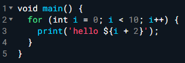
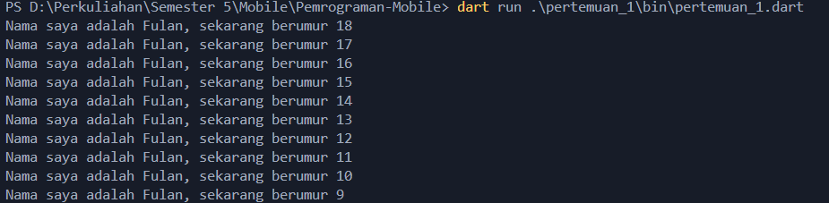

Nama   : Achmad Raihan Fahrezi Effendy \
NIM    : 2241720192 \
Kelas  : TI-3D

<h3 style="text-align: center; font-weight: bold;">
Pengantar Bahasa Pemrograman Dart - Bagian 1
</h3>

Bahasa Dart adalah inti dari framework Flutter. Kerangka kerja modern seperti Flutter membutuhkan bahasa modern tingkat tinggi agar bisa memberikan pengalaman terbaik kepada pengembang, serta memungkinkan untuk membuat aplikasi seluler yang luar biasa. Memahami Dart adalah dasar untuk bekerja dengan Flutter; pengembang perlu mengetahui asal-usul bahasa Dart, bagaimana komunitas mengerjakannya, kelebihannya, dan mengapa itu adalah bahasa pemrograman yang dipilih untuk Flutter.

Dalam codelab ini, Anda akan meninjau dasar-dasar bahasa Dart dan mengidentifikasi sumber daya yang dapat membantu Anda dalam perjalanan Flutter Anda. Anda akan mempelajari tipe data dan operator bawaan Dart serta bagaimana Dart bekerja dengan pemrograman berorientasi objek (OOP). Dengan memahami bahasa Dart, Anda akan merasa nyaman untuk bereksperimen dengan Dart dan dapat memperluas pengetahuan Anda.

### Tugas Praktikum

---

#### Soal 1
Modifikasilah kode pada baris 3 di VS Code atau Editor Code favorit Anda berikut ini agar mendapatkan keluaran (output) sesuai yang diminta!
<div align="center">

</div>

Output yang diminta:
<div align="center">

</div>

##### Jawaban
Source Code:
```dart
void main() {
  for (int age = 18; age > 8; age--) {
    print('Nama saya adalah Fulan, sekarang berumur $age');
  }
}
```

Output:
<div align="center">

</div>

---

#### Soal 2
Mengapa sangat penting untuk memahami bahasa pemrograman Dart sebelum kita menggunakan framework Flutter ? Jelaskan!

##### Jawaban

Sebelum menggunakan framework Flutter kita perlu memahami beberapa hal:
**1. Dasar Pemrograman Flutter**
Flutter menggunakan Dart sebagai bahasa pemrograman utamanya. Sebagian besar kode dalam aplikasi Flutter ditulis dalam Dart, sehingga pemahaman yang kuat tentang bahasa ini membantu dalam menulis, memahami, dan memelihara kode aplikasi.
**2. Sintaks dan Struktur**
Dart memiliki sintaks dan struktur yang spesifik yang berbeda dari bahasa lain seperti JavaScript atau Java. Mengetahui sintaks Dart membantu dalam menulis kode yang lebih bersih dan menghindari kesalahan.
**3. Konsep dan Paradigma**
Dart mendukung paradigma pemrograman berorientasi objek dan asinkron. Memahami konsep seperti kelas, objek, future, dan async/await sangat penting untuk menggunakan Flutter secara efektif, karena banyak fitur Flutter bergantung pada konsep-konsep ini.
**4. Efisiensi dan Kinerja**
Dart dirancang untuk performa yang optimal pada aplikasi mobile. Memahami bagaimana Dart bekerja membantu dalam mengoptimalkan aplikasi Flutter untuk kecepatan dan efisiensi, termasuk pengelolaan memori dan penanganan asinkron.
**5. Integrasi dengan Flutter**
Banyak fitur dan paket dalam Flutter bergantung pada pengetahuan tentang Dart. Mengetahui Dart memungkinkan pengembang untuk lebih mudah menggunakan dan menyesuaikan paket atau plugin yang ada.
**6. Debugging dan Pemeliharaan**
Memahami Dart memudahkan dalam proses debugging dan pemeliharaan kode. Jika Anda memahami bahasa di balik Flutter, Anda akan lebih mudah menemukan dan memperbaiki masalah dalam aplikasi.

#### Soal 3
Rangkumlah materi dari codelab ini menjadi poin-poin penting yang dapat Anda gunakan untuk membantu proses pengembangan aplikasi mobile menggunakan framework Flutter.

##### Jawaban

Bahasa Dart adalah inti dari framework Flutter. Kerangka kerja modern seperti Flutter membutuhkan bahasa modern tingkat tinggi agar bisa memberikan pengalaman terbaik kepada pengembang, serta memungkinkan untuk membuat aplikasi seluler yang luar biasa. Memahami Dart adalah dasar untuk bekerja dengan Flutter; pengembang perlu mengetahui asal-usul bahasa Dart, bagaimana komunitas mengerjakannya, kelebihannya, dan mengapa itu adalah bahasa pemrograman yang dipilih untuk Flutter.

Dart bertujuan untuk menggabungkan kelebihan-kelebihan dari sebagian besar bahasa tingkat tinggi dengan fitur-fitur bahasa pemrograman terkini, antara lain sebagai berikut:

- Productive tooling: merupakan fitur kakas (tool) untuk menganalisis kode, plugin IDE, dan ekosistem paket yang besar.
- Garbage collection: untuk mengelola atau menangani dealokasi memori (terutama memori yang ditempati oleh objek yang tidak lagi digunakan).
- Type annotations (opsional): untuk keamanan dan konsistensi dalam mengontrol semua data dalam aplikasi.
- Statically typed: Meskipun type annotations bersifat opsional, Dart tetap aman karena menggunakan fitur type-safe dan type inference untuk menganalisis types saat runtime. Fitur ini penting untuk menemukan bug selama kompilasi kode.
- Portability: bahasa Dart tidak hanya untuk web (yang dapat diterjemahkan ke JavaScript) tetapi juga dapat dikompilasi secara native ke kode Advanced RISC Machines (ARM) dan x86.

Dart rilis tahun 2011, versi stabil 2013, dan dart 2.0 pada 2018
Awalnya fokus pada web, namun kemudian beralih fokus pada mobile.
Dart VM and JavaScript compilation
bahasa Dart perlu memperhatikan fitur-fitur penting seperti berikut:
- Runtime systems
- Dart core libraries
- Garbage collectors

Eksekusi kode Dart dapat beroperasi dalam dua mode — kompilasi Just-In-Time (JIT) atau Kompilasi Ahead-Of-Time (AOT). 


#### Soal 4
Buatlah slide yang berisi penjelasan dan contoh eksekusi kode tentang perbedaan Null Safety dan Late variabel ! **(Khusus soal ini kelompok berupa link google slide)**

Kumpulkan jawaban Anda di spreadsheet pada tautan yang telah disediakan di grup telegram. Untuk soal nomor 1 sampai 3 push repo GitHub Anda.

##### Jawaban
Berikut link Google Slide : [Google Slide](https://docs.google.com/presentation/d/1qXPq_7wM58CiylAD3zQ9ojNNUfDdGOFQetuMqXtPqMM/edit?usp=sharing)