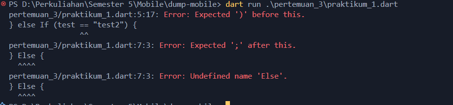

Nama   : Achmad Raihan Fahrezi Effendy \
NIM    : 2241720192 \
Kelas  : TI-3D

<h3 style="text-align: center; font-weight: bold;">
Pengantar Bahasa Pemrograman Dart - Bagian 2
</h3>

Pada pengantar bahasa pemrograman Dart bagian 3 ini, akan melakukan praktik untuk bereksperimen dengan control flows (if/else) dan perulangan. Hal ini cukup penting diketahui terutama bagi yang belum memiliki dasar pemrograman sebelumnya.

Dengan mengetahui materi ini, diharapkan mampu untuk menerapkannya pada Framework Flutter untuk menangani kondisi-kondisi tertentu baik itu berupa interaksi dengan pengguna maupun komunikasi data.

**Tujuan Praktikum**
Setelah menyelesaikan codelab ini akan mampu untuk:

- Menerapkan control flows pada bahasa pemrograman Dart
- Menerapkan perulangan pada bahasa pemrograman Dart

### Praktikum 1

Menerapkan Control Flows ("if/else")

Selesaikan langkah-langkah praktikum berikut ini menggunakan DartPad di browser Anda.

#### Praktikum 1 - Langkah 1

Ketik atau salin kode program berikut ke dalam fungsi main().

```dart
String test = "test2";
if (test == "test1") {
   print("Test1");
} else If (test == "test2") {
   print("Test2");
} Else {
   print("Something else");
}

if (test == "test2") print("Test2 again");
```

#### Praktikum 1 - Langkah 2

Silakan coba eksekusi (Run) kode pada langkah 1 tersebut. Apa yang terjadi? Jelaskan!



Ketika menjalankan kode tersebut, akan terjadi kesalahan sintaksis. Masalah dalam program tersebut adalah

- Penggunaan Else If dan Else
Else If dan Else harus ditulis dalam huruf kecil (else if dan else). Dart adalah bahasa pemrograman yang peka terhadap huruf besar/kecil (case-sensitive), jadi Else If dan Else bukanlah sintaks yang valid.

Perbaikan

```dart
void main() {
  String test = "test2";
if (test == "test1") {
   print("Test1");
} else if (test == "test2") {
   print("Test2");
} else {
   print("Something else");
}

if (test == "test2") print("Test2 again");
}
```
Output


#### Praktikum 1 - Langkah 3

Tambahkan kode program berikut, lalu coba eksekusi (Run) kode Anda.

```dart
String test = "true";
if (test) {
   print("Kebenaran");
}
```

Apa yang terjadi ? Jika terjadi error, silakan perbaiki namun tetap menggunakan if/else.


Ketika menjalankan kode tersebut, akan terjadi kesalahan sintaksis. Masalah dalam program tersebut adalah

- Terdapat nama variable yang di instansiasi 2 kali
- Terdapat pengecekan kondisi yang harusnya bernilai boolean namun di isi dengan nilai String

Perbaikan

```dart
String test2 = "true";
if (test == "true") {
   print("Kebenaran");
}
```

Output


> Equality checking and type coercion
Di JavaScript, pemeriksaan dua variable dapat menggunakan double "==" atau triple "===". Untuk double "==" hanya membandingkan nilainya saja, sedangkan triple "===" dibandingkan dengan tipe datanya. Contohnya dalam JavaScript, "7" == 7 akan bernilai true, tetapi "7" === 7 akan bernilai false. Ini bisa jadi sebuah bug jika lupa dengan operator ini. Dart cukup menggunakan double "==" untuk membandingkan nilai sekaligus tipe datanya.

Berikut tambahan video materi terkait Conditional Expressions dan Switch-Case statements.

<iframe width="560" height="315" src="https://www.youtube.com/embed/qNWcoc25Ex4" title="Dart Conditional Expressions: Ternary Operator of Java. Dart Flutter Tutorial #4.2" frameborder="0" allow="accelerometer; autoplay; clipboard-write; encrypted-media; gyroscope; picture-in-picture; web-share" referrerpolicy="strict-origin-when-cross-origin" allowfullscreen></iframe>

<iframe width="560" height="315" src="https://www.youtube.com/embed/XwehKYcCHzY" title="Dart SWITCH and CASE conditional statements. Dart Tutorial for Flutter #4.3" frameborder="0" allow="accelerometer; autoplay; clipboard-write; encrypted-media; gyroscope; picture-in-picture; web-share" referrerpolicy="strict-origin-when-cross-origin" allowfullscreen></iframe>

### Praktikum 2

Menerapkan Perulangan "while" dan "do-while"

Selesaikan langkah-langkah praktikum berikut ini menggunakan DartPad di browser Anda.

#### Praktikum 2- Langkah 1

Ketik atau salin kode program berikut ke dalam fungsi `main()`.

```dart
while (counter < 33) {
  print(counter);
  counter++;
}
```

#### Praktikum 2 - Langkah 2

Silakan coba eksekusi (Run) kode pada langkah 1 tersebut. Apa yang terjadi? Jelaskan! Lalu perbaiki jika terjadi error.


Ketika menjalankan kode tersebut, akan terjadi kesalahan sintaksis. Masalah dalam program tersebut adalah

- Belum ada inisialisasi variable counter

Perbaikan

```dart
void main() {
   int counter = 0;
  while (counter < 33) {
    print(counter);
    counter++;
  }
}

```

Output


#### Praktikum 2 - Langkah 3

Tambahkan kode program berikut, lalu coba eksekusi (Run) kode Anda.

```dart
do {
  print(counter);
  counter++;
} while (counter < 77);
```

Apa yang terjadi ? Jika terjadi error, silakan perbaiki namun tetap menggunakan do-while.

Setelah while, kita menambahkan perulangan do-whileakan selalu menjalankan blok kode setidaknya satu kali sebelum memeriksa kondisi. Dalam kasus ini, setelah perulangan while selesai, counter sudah bernilai 33. Perulangan do-while akan mulai dari 33 dan mencetak nilai counter hingga 76, karena kondisi counter < 77 akan menjadi false setelah counter mencapai 77.

<iframe width="560" height="315" src="https://www.youtube.com/embed/JuOHAd0LWPE" title="Dart Loops and Iterators: Loop Control Statements. Dart Flutter Tutorial #5.1" frameborder="0" allow="accelerometer; autoplay; clipboard-write; encrypted-media; gyroscope; picture-in-picture; web-share" referrerpolicy="strict-origin-when-cross-origin" allowfullscreen></iframe>

### Praktikum 3

Menerapkan Perulangan "for" dan "break-continue"

Selesaikan langkah-langkah praktikum berikut ini menggunakan DartPad di browser Anda.

#### Praktikum 3 - Langkah 1

Ketik atau salin kode program berikut ke dalam fungsi `main()`.

```dart
for (Index = 10; index < 27; index) {
  print(Index);
}
```

#### Praktikum 3 - Langkah 2

Silakan coba eksekusi (Run) kode pada langkah 1 tersebut. Apa yang terjadi? Jelaskan! Lalu perbaiki jika terjadi error.


Ketika menjalankan kode tersebut, akan terjadi kesalahan sintaksis. Masalah dalam program tersebut adalah

- Saat mendeklarasi variabel Index masih belum benar
- Sintaks index tidak diinkrementasi dengan benar; seharusnya index++ atau index = index + 1. Sebenarnya bisa saja dijalankan namun akan terjadi inifinit loop
- Penggunaan huruf kapital pada Index dan index tidak konsisten.

Perbaikan

```dart
void main() {

  for (int index = 10; index < 27; index++) {
    print(index);
  }
}
```

Output


#### Praktikum 3 - Langkah 3

Tambahkan kode program berikut di dalam for-loop, lalu coba eksekusi (Run) kode Anda.

```dart
If (Index == 21) break;
Else If (index > 1 || index < 7) continue;
print(index);
```

Apa yang terjadi ? Jika terjadi error, silakan perbaiki namun tetap menggunakan for dan break-continue.


Ketika menjalankan kode tersebut, akan terjadi kesalahan sintaksis. Masalah dalam program tersebut adalah

- Penulisan syntax (if-else if) tidak sesuai yang seharusnya lowercase terdapat uppercase
- Terdapat kesalahan penulisan variable Index yang seharusnya index
- Kesalahan Kondisi pada (else-if) jika kita menggunakan || maka tidak akan muncul apapun karena kondisi selalu benar untuk index > 1 

Perbaikan

```dart
void main() {
  for (int index = 10; index < 27; index++) {
    print(index);
    if (index == 21) break;
    else if (index > 1 && index < 7) continue;

  }
}
```

Output


<iframe width="560" height="315" src="https://www.youtube.com/embed/BCiyJOb7X-w" title="Dart FOR Loop and how it works internally. Dart Tutorial for Flutter #5.2" frameborder="0" allow="accelerometer; autoplay; clipboard-write; encrypted-media; gyroscope; picture-in-picture; web-share" referrerpolicy="strict-origin-when-cross-origin" allowfullscreen></iframe>

### Tugas Praktikum

Buatlah sebuah program yang dapat menampilkan bilangan prima dari angka 0 sampai 201 menggunakan Dart. Ketika bilangan prima ditemukan, maka tampilkan nama lengkap dan NIM Anda.

```dart
bool isPrime(int number) {
  if (number < 2) return false;
  for (int i = 2; i <= number / 2; i++) {
    if (number % i == 0) return false;
  }
  return true;
}

void main() {
  int number = 201;
  String name = "Achmad Raihan Fahrezi Effendy";
  String nim = "2241720192";

  for (int i = 2; i <= number; i++) {
    if (isPrime(i)) {
      print(i);
    }
  }

  print("Nama  : $name");
  print("NIM   : $nim");
}
```

Output


Penjelasan 

- Fungsi isPrime
Tujuan: Menentukan apakah sebuah angka adalah bilangan prima.
Logika:
  - Angka kurang dari 2 bukan bilangan prima.
  - Untuk angka lainnya, fungsi ini memeriksa apakah ada divisor dari 2 hingga setengah dari angka tersebut. Jika ada, angka tersebut bukan bilangan prima.

- Fungsi main:
 - Inisialisasi Variabel:
    - number: Batas atas pencarian bilangan prima, yaitu 201.
    - name: Nama lengkap.
    - nim: Nomor induk mahasiswa.

 - Looping
    - Iterasi dari 2 hingga number (201).
    - Memanggil fungsi isPrime untuk setiap angka. Jika angka tersebut bilangan prima, maka angka tersebut dicetak.

 - Output:
   - menampilkan semua bilangan prima.
   - Menampilkan nama lengkap dan NIM. 