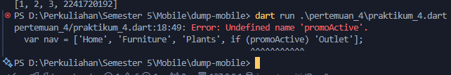
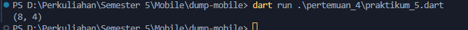

# Pemrograman Mobile - Pertemuan 4

<table>
  <thead>
    <th colspan="2" style="text-align: center;">Pertemuan 4</th>
  </thead>
  <tbody>
    <tr>
      <td>NIM</td>
      <td>2241720192</td>
    </tr>
    <tr>
      <td>Nama</td>
      <td>Achmad Raihan Fahrezi Effendy</td>
    </tr>
    <tr>
      <td>Kelas</td>
      <td>TI-3D</td>
    </tr>
</table>

---

<h3 style="text-align: center; font-weight: bold;">
Pengantar Bahasa Pemrograman Dart - Bagian 3
</h3>

<div style="text-align: center;">
<iframe style="width: 400px;
            height: 250px;" class="embedded-iframe" src="https://docs.google.com/presentation/d/e/2PACX-1vQpHS_kGWEIeiwfiV6EDb01VM-oOKiCexlRodQzTDqtTihlb2Q1yy-aFtq7NlUIjtQajhOmW3TsDIEN/embed?start=false&amp;loop=false&amp;delayms=5000"></iframe>
</div>

Pada pengantar bahasa pemrograman Dart bagian 3 ini, Anda akan melakukan praktik untuk bereksperimen dengan colletctions, records, dan functions. Hal ini cukup penting diketahui terutama bagi Anda yang belum memiliki dasar pemrograman sebelumnya.

Dengan mempelajari materi ini, Anda diharapkan mampu untuk menerapkannya pada Framework Flutter untuk menangani data dalam bentuk collections dan record serta memanfaatkan functions.

**Tujuan Praktikum**
Setelah menyelesaikan codelab ini Anda akan mampu untuk:

- Menerapkan collections pada bahasa pemrograman Dart
- Menerapkan records pada bahasa pemrograman Dart
- Menerapkan functions pada bahasa pemrograman Dart

---

### Praktikum 1

Eksperimen Tipe Data List

Selesaikan langkah-langkah praktikum berikut ini menggunakan VS Code atau Code Editor favorit Anda.

#### Praktikum 1 - Langkah 1

Ketik atau salin kode program berikut ke dalam `void main()`.

```dart
var list = [1, 2, 3];
assert(list.length == 3);
assert(list[1] == 2);
print(list.length);
print(list[1]);

list[1] = 1;
assert(list[1] == 1);
print(list[1]);
```

#### Praktikum 1 - Langkah 2

Silakan coba eksekusi (Run) kode pada langkah 1 tersebut. Apa yang terjadi? Jelaskan!


Penjelasan

- Program akan mencetak 3 untuk panjang list.
- Program akan mencetak 2, yang merupakan elemen pada indeks 1 sebelum diubah.
- Setelah mengganti nilai elemen indeks 1 dari 2 menjadi 1, kode akan mencetak

#### Praktikum 1 - Langkah 3

Ubah kode pada langkah 1 menjadi variabel final yang mempunyai index = 5 dengan default value = null. Isilah nama dan NIM Anda pada elemen index ke-1 dan ke-2. Lalu print dan capture hasilnya.

Apa yang terjadi ? Jika terjadi error, silakan perbaiki.

Perubahan

```dart
void main() {
  final List<String?> list = List.filled(5, null);
  list[1] = 'Achmad Raihan Fahrezi Effendy';
  list[2] = '2241720192';

  for (var item in list) {
    print(item);
  }
}
```

Output


Penjelasan

- `final List<String?> list = List.filled(5, null);` digunakan untuk membuat list dengan panjang 5, diisi dengan null.
- `list[1] = 'Nama Anda';` digunakan untuk mengisi indeks 1 dengan nama Anda.
- `list[2] = 'NIM Anda';` digunakan untuk mengisi indeks 2 dengan NIM Anda.
- `for (var item in list) { print(item); }` digunakan untuk mencetak setiap elemen dalam list.

Kesimpulan

Variabel final memungkinkan perubahan pada objek yang direferensikan tetapi tidak memungkinkan perubahan referensi itu sendiri. Sedangkan variabel const tidak hanya melarang perubahan pada referensi tetapi juga pada isi objek yang direferensikan.

> Catatan:
Dart akan melakukan infers pada variabel list dengan tipe data List. Jika Anda mencoba menambahkan elemen berupa objek non-integer pada list, maka analyzer atau runtime akan error. Informasi lebih lanjut dapat membaca di tautan ini type inference.

---

### Praktikum 2

Eksperimen Tipe Data Set

Selesaikan langkah-langkah praktikum berikut ini menggunakan VS Code atau Code Editor favorit Anda.

#### Praktikum 2- Langkah 1

Ketik atau salin kode program berikut ke dalam fungsi `main()`.

```dart
var halogens = {'fluorine', 'chlorine', 'bromine', 'iodine', 'astatine'};
print(halogens);
```

#### Praktikum 2 - Langkah 2

Silakan coba eksekusi (Run) kode pada langkah 1 tersebut. Apa yang terjadi? Jelaskan! Lalu perbaiki jika terjadi error.


Penjelasan

- var halogens = {'fluorine', 'chlorine', 'bromine', 'iodine', 'astatine'}; merupakan sebuah Set yang berisi elemen-elemen nama unsur halogen.
- print(halogens); akan mencetak isi dari Set tersebut ke konsol.

#### Praktikum 2 - Langkah 3

Tambahkan kode program berikut, lalu coba eksekusi (Run) kode Anda.

```dart
var names1 = <String>{};
Set<String> names2 = {}; // This works, too.
var names3 = {}; // Creates a map, not a set.

print(names1);
print(names2);
print(names3);
```

Apa yang terjadi ? Jika terjadi error, silakan perbaiki namun tetap menggunakan ketiga variabel tersebut. Tambahkan elemen nama dan NIM Anda pada kedua variabel Set tersebut dengan dua fungsi berbeda yaitu `.add()` dan `.addAll()`. Untuk variabel Map dihapus, nanti kita coba di praktikum selanjutnya.

Dokumentasikan code dan hasil di console, lalu buat laporannya.

Output


Penambahan Kode

```dart
void main() {
  var halogens = {'fluorine', 'chlorine', 'bromine', 'iodine', 'astatine'};
  print(halogens);

  var names1 = <String>{};
  Set<String> names2 = {}; // This works, too.
  var names3 = {}; // Creates a map, not a set.

  print(names1);
  print(names2);
  print(names3);

  // Menambahkan elemen ke names1 dan names2
  names1.add('Achmad Raihan Fahrezi Effendy'); 
  names1.add('2241720192');
  names2.addAll(['Achmad Raihan Fahrezi Effendy', '2241720192']);

  print(names1);
  print(names2);
}
```

Penjelasan

- `var names1 = <String>{};` digunakan untuk mendeklarasikan sebuah Set kosong dengan tipe data String.
- `Set<String> names2 = {};` digunakan untuk mendeklarasikan sebuah Set kosong dengan tipe data String. Ini adalah cara lain untuk mendeklarasikan Set.
- `var names3 = {};`  digunakan untuk medeklarasi Map kosong, bukan Set. Ini tidak akan memberikan error dalam konteks deklarasi, tetapi tidak digunakan dalam praktikum ini.

Output


Penjelasan

- `names1.add('Achmad Raihan Fahrezi Effendy');` digunakan untuk menambahkan elemen pada ke dalam Set names1 menggunakan metode `.add()`, disini kita menggunakan contoh menambahkan nama kedalam set
- `names1.add('2241720192');` digunakan untuk menambahkan elemen ke dalam Set names1 menggunakan metode `.add()`, disini kita menggunakan contoh menambahkan nim kedalam set
- `names2.addAll(['Achmad Raihan Fahrezi Effendy', '2241720192']);` digunakan untuk menambahkan beberapa elemen sekaligus ke dalam Set names2 menggunakan metode `.addAll()`, disini kita dapat menambahkan nama dan nim sekaligus kedalam set

---

### Praktikum 3

Eksperimen Tipe Data Maps

Selesaikan langkah-langkah praktikum berikut ini menggunakan VS Code atau Code Editor favorit Anda.

#### Praktikum 3 - Langkah 1

Ketik atau salin kode program berikut ke dalam fungsi `main()`.

```dart
var gifts = {
  // Key:    Value
  'first': 'partridge',
  'second': 'turtledoves',
  'fifth': 1
};

var nobleGases = {
  2: 'helium',
  10: 'neon',
  18: 2,
};

print(gifts);
print(nobleGases);
```

#### Praktikum 3 - Langkah 2

Silakan coba eksekusi (Run) kode pada langkah 1 tersebut. Apa yang terjadi? Jelaskan! Lalu perbaiki jika terjadi error.


Penjelasan

- `gifts` adalah map dengan kunci bertipe `String` dan value(nilai) bertipe `dynamic`. Nilai `1` pada kunci 'fifth' adalah `integer`.
- `nobleGases` adalah map dengan kunci bertipe `int` dan value(nilai) bertipe `dynamic`. Nilai `2` pada kunci 18 adalah `integer`.

Tidak ada error pada langkah ini karena Dart memungkinkan penggunaan tipe data campuran dalam map. Namun, jika ingin lebih konsisten perlu mendefinisikan tipe data dalam map.

#### Praktikum 3 - Langkah 3

Tambahkan kode program berikut, lalu coba eksekusi (Run) kode Anda.

```dart
var mhs1 = Map<String, String>();
gifts['first'] = 'partridge';
gifts['second'] = 'turtledoves';
gifts['fifth'] = 'golden rings';

var mhs2 = Map<int, String>();
nobleGases[2] = 'helium';
nobleGases[10] = 'neon';
nobleGases[18] = 'argon';
```

Apa yang terjadi ? Jika terjadi error, silakan perbaiki.

Tambahkan elemen nama dan NIM Anda pada tiap variabel di atas (`gifts`, `nobleGases`, `mhs1`, dan `mhs2`). Dokumentasikan hasilnya dan buat laporannya!


Terjadi error jika kita mendefinisikan key dengan `String` dikarenakan beberapa tipe default untuk variable nobleGases, dan mhs2 key harus bertipe int maka kita harus mengubah key nya menjadi int

Perbaikan

```dart
void main() {
  var gifts = {
    // Key:    Value
    'first': 'partridge',
    'second': 'turtledoves',
    'fifth': 1
  };

  var nobleGases = {
    2: 'helium',
    10: 'neon',
    18: 2,
  };

  var mhs1 = Map<String, String>();
  var mhs2 = Map<int, String>();

  gifts['nama'] = 'Achmad Raihan Fahrezi Effendy';
  gifts['nim'] = '2241720192';

  nobleGases[3] = 'Achmad Raihan Fahrezi Effendy';
  nobleGases[4] = '2241720192';

  mhs1['nama'] = 'Achmad Raihan Fahrezi Effendy';
  mhs1['nim'] = '2241720192';

  mhs2[0] = 'Achmad Raihan Fahrezi Effendy';
  mhs2[1] = '2241720192';

  print(gifts);
  print(nobleGases);
  print(mhs1);
  print(mhs2);
}
```

Output


Jadi disini saya mengubah beberapa key yang kosong dan mengisi nama dan nim untuk `gifts` dan `mhs1` saya dapat mendefinisikan key pada map dapat berisi string, sedangkan
untuk `nobleGases` dan `mhs2` saya dapat mendefinisikan key pada map hanya dapat berisi int

---

### Praktikum 4

Eksperimen Tipe Data List: Spread dan Control-flow Operators

Selesaikan langkah-langkah praktikum berikut ini menggunakan VS Code atau Code Editor favorit Anda.

#### Praktikum 4 - Langkah 1

Ketik atau salin kode program berikut ke dalam fungsi `main()`.

```dart
var list = [1, 2, 3];
var list2 = [0, ...list];
print(list1);
print(list2);
print(list2.length);
```

#### Praktikum 4 - Langkah 2

Silakan coba eksekusi (Run) kode pada langkah 1 tersebut. Apa yang terjadi? Jelaskan! Lalu perbaiki jika terjadi error.


Penjelasan
Terjadi error, kemungkinan besar itu disebabkan oleh kesalahan penulisan atau kesalahan nama variabel (`list1` yang tidak dideklarasikan)

Perbaikan

```dart
void main() {
  var list = [1, 2, 3];
  var list2 = [0, ...list];
  print(list);
  print(list2);
  print(list2.length);
}
```

Output


Penjelasan
Disini kita cukup mengubah `print(list1);` menjadi `print(list);` karena `list1` tidak ada yang telah di deklarasi yaitu `list`

#### Praktikum 4 - Langkah 3

Tambahkan kode program berikut, lalu coba eksekusi (Run) kode Anda.

```dart
list1 = [1, 2, null];
print(list1);
var list3 = [0, ...?list1];
print(list3.length);
```

Apa yang terjadi ? Jika terjadi error, silakan perbaiki.

Tambahkan variabel list berisi NIM Anda menggunakan Spread Operators. Dokumentasikan hasilnya dan buat laporannya!


Penjelasan
Terjadi kesalahan karena varibel `list1` belum di deklarasi

Perbaikan

```dart
void main() {
  var list = [1, 2, 3];
  var list2 = [0, ...list];
  print(list);
  print(list2);
  print(list2.length);

  var list1 = [1, 2, null];
  print(list1);
  var list3 = [0, ...?list1];
  print(list3.length);
}
```

Output


Penjelasan
`...?list1` memeriksa apakah `list1` bukan `null` sebelum mengekspansi elemen-elemen `list1` ke dalam `list3`.

Penambahan NIM

```dart
void main() {
  var list = [1, 2, 3];
  var list2 = [0, ...list];
  print(list);
  print(list2);
  print(list2.length);

  var list1 = [1, 2, null];
  print(list1);
  var list3 = [0, ...?list1];
  print(list3.length);

  var listWithNIM = [...list, 2241720192];
  print(listWithNIM);
}
```

Output


Penjelasan
`listWithNim` adalah list yang menggabungkan elemen dari `list` dengan `nim`

#### Praktikum 4 - Langkah 4

Tambahkan kode program berikut, lalu coba eksekusi (Run) kode Anda.

```dart
var nav = ['Home', 'Furniture', 'Plants', if (promoActive) 'Outlet'];
print(nav);
```

Apa yang terjadi ? Jika terjadi error, silakan perbaiki. Tunjukkan hasilnya jika variabel `promoActive` ketika `true` dan `false`.

Output


Penjelasan
Varibel `promoActive` tidak dideklarasikan

Perbaikan

```dart
void main() {
  var list = [1, 2, 3];
  var list2 = [0, ...list];
  print(list);
  print(list2);
  print(list2.length);

  // langkah 3
  var list1 = [1, 2, null];
  print(list1);
  var list3 = [0, ...?list1];
  print(list3.length);

  var listWithNIM = [...list, 2241720192];
  print(listWithNIM);

  // langkah 4
  var promoActive = true;
  var nav = ['Home', 'Furniture', 'Plants', if (promoActive) 'Outlet'];
  print(nav);
}
```

Output


Penjelasan

- Jika `promoActive = true` maka akan menampilkan `['Home', 'Furniture', 'Plants', 'Outlet']`
- Jika `promoActive = false` maka akan menampilkan `['Home', 'Furniture', 'Plants']`

#### Praktikum 4 - Langkah 5

Tambahkan kode program berikut, lalu coba eksekusi (Run) kode Anda.

```dart
var nav2 = ['Home', 'Furniture', 'Plants', if (login case 'Manager') 'Inventory'];
print(nav2);
```

Apa yang terjadi ? Jika terjadi error, silakan perbaiki. Tunjukkan hasilnya jika variabel `login` mempunyai kondisi lain.

Output


Penjelasan
Varibel `login` tidak dideklarasikan

Perbaikan

```dart
void main() {
  var list = [1, 2, 3];
  var list2 = [0, ...list];
  print(list);
  print(list2);
  print(list2.length);

  // langkah 3
  var list1 = [1, 2, null];
  print(list1);
  var list3 = [0, ...?list1];
  print(list3.length);

  var listWithNIM = [...list, 2241720192];
  print(listWithNIM);

  // langkah 4
  var promoActive = true;
  var nav = ['Home', 'Furniture', 'Plants', if (promoActive) 'Outlet'];
  print(nav);

  // langkah 5
  var login = 'Manager';
  var nav2 = ['Home', 'Furniture', 'Plants', if (login case 'Manager') 'Inventory'];
  print(nav2);
}
```

Output


Penjelasan

- Jika `login` adalah `'Manager', 'Inventory'` akan ditambahkan ke `nav2`.
- Jika `login` adalah nilai lain, `'Inventory'` tidak akan ditambahkan.

#### Praktikum 4 - Langkah 6

Tambahkan kode program berikut, lalu coba eksekusi (Run) kode Anda.

```dart
var listOfInts = [1, 2, 3];
var listOfStrings = ['#0', for (var i in listOfInts) '#$i'];
assert(listOfStrings[1] == '#1');
print(listOfStrings);
```

Apa yang terjadi ? Jika terjadi error, silakan perbaiki. Jelaskan manfaat **Collection For** dan dokumentasikan hasilnya.

Output


Penjelasan
`listOfStrings` dibuat menggunakan collection for, yang menghasilkan list dari string dengan format `#i` untuk setiap elemen `i` dalam `listOfInts`

Manfaat

- Transformasi Data: Memungkinkan untuk membuat list baru dengan elemen yang diubah dari list yang ada.
- Keterbacaan Kode: Mengurangi jumlah kode boilerplate yang diperlukan untuk membuat list baru.
- Efisiensi: Menghindari kebutuhan untuk loop eksplisit, menjadikan kode lebih ringkas dan efisien.

### Praktikum 5

Eksperimen Tipe Data Records

> Catatan: Tipe data Records mulai diperkenalkan pada Dart versi 3.0. Pastikan Anda sudah setup menggunakan Dart 3.0 atau yang lebih baru.

Selesaikan langkah-langkah praktikum berikut ini menggunakan VS Code atau Code Editor favorit Anda.

#### Praktikum 5 - Langkah 1

Ketik atau salin kode program berikut ke dalam fungsi `main()`.

```dart
var record = ('first', a: 2, b: true, 'last');
print(record);
```

#### Praktikum 5 - Langkah 2

Silakan coba eksekusi (Run) kode pada langkah 1 tersebut. Apa yang terjadi? Jelaskan! Lalu perbaiki jika terjadi error.

Output


Penjelasan
Kode ini akan berjalan dengan baik dan mencetak nilai dari `record`.

#### Praktikum 5 - Langkah 3

Tambahkan kode program berikut di luar scope `void main()`, lalu coba eksekusi (Run) kode Anda.

```dart
(int, int) tukar((int, int) record) {
  var (a, b) = record;
  return (b, a);
}
```

Apa yang terjadi ? Jika terjadi error, silakan perbaiki. Gunakan fungsi `tukar()` di dalam `main()` sehingga tampak jelas proses pertukaran value field di dalam Records.

Output


Penjelasan
Terjadi kesalahan fungsi tukar mendefinisikan parameter dengan tipe (int, int), sementara record yang diberikan dalam main tidak cocok dengan tipe tersebut.

Perbaikan

```dart
(int, int) tukar((int, int) record) {
  var (a, b) = record;
  return (b, a);
}

void main() {
  // var record = ('first', a: 2, b: true, 'last');
  var record = (4, 8); // nilai baru sesuai fungsi tukar membutuhkan (int, int)
  var hasilTukar = tukar(record);
  print(hasilTukar);
}
```

Output



Penjelasan

- Fungsi tukar:
  - Menerima parameter tuple (int, int).
  - Memisahkan tuple menjadi dua variabel a dan b.
  - Mengembalikan tuple dengan posisi dibalik, (b, a).
- Fungsi main:
  - Mendefinisikan record sebagai tuple (4, 8).
  - Memanggil fungsi tukar dengan record dan menyimpan hasilnya.
  - Mencetak hasil yang merupakan tuple (8, 4).

#### Praktikum 5 - Langkah 4

Tambahkan kode program berikut di dalam scope `void main()`, lalu coba eksekusi (Run) kode Anda.

```dart
// Record type annotation in a variable declaration:
(String, int) mahasiswa;
print(mahasiswa);
```

Apa yang terjadi ? Jika terjadi error, silakan perbaiki. Inisialisasi field nama dan NIM Anda pada variabel record `mahasiswa` di atas. Dokumentasikan hasilnya dan buat laporannya!

```dart
(int, int) tukar((int, int) record) {
  var (a, b) = record;
  return (b, a);
}

void main() {
  // var record = ('first', a: 2, b: true, 'last');
  var record = (4, 8);
  var hasilTukar = tukar(record);
  print(hasilTukar);

  // langkah 4
  (String, int) mahasiswa = ('Achmad Raihan Fahrezi Effendy', 2241720192);
  print(mahasiswa);
}
```


penjelasan
`mahasiswa` berisi dua field, nama dan NIM.

#### Praktikum 5 - Langkah 5

Tambahkan kode program berikut di dalam scope `void main()`, lalu coba eksekusi (Run) kode Anda.

```dart
var mahasiswa2 = ('first', a: 2, b: true, 'last');

print(mahasiswa2.$1); // Prints 'first'
print(mahasiswa2.a); // Prints 2
print(mahasiswa2.b); // Prints true
print(mahasiswa2.$2); // Prints 'last'
```

Apa yang terjadi ? Jika terjadi error, silakan perbaiki. Gantilah salah satu isi record dengan nama dan NIM Anda, lalu dokumentasikan hasilnya dan buat laporannya!

Output


Penjelasan
Dengan menggunakan notasi $ untuk elemen posisi dan notasi titik (.) untuk elemen bernama, kita bisa dengan mudah mengakses dan memanipulasi data dalam record.

- Elemen posisi pertama ($1): 'John Doe' (nama)
- Elemen bernama a: 123456 (NIM)
- Elemen bernama b: true (status aktif atau bukan)
- Elemen posisi kedua ($2): 'lastName' (nama belakang, atau bisa dianggap sebagai placeholder)

---

### Tugas Praktikum

1. Silakan selesaikan Praktikum 1 sampai 5, lalu dokumentasikan berupa screenshot hasil pekerjaan Anda beserta penjelasannya!
2. Jelaskan yang dimaksud Functions dalam bahasa Dart!
3. Jelaskan jenis-jenis parameter di Functions beserta contoh sintaksnya!
4. Jelaskan maksud Functions sebagai first-class objects beserta contoh sintaknya!
5. Apa itu Anonymous Functions? Jelaskan dan berikan contohnya!
6. Jelaskan perbedaan Lexical scope dan Lexical closures! Berikan contohnya!
7. Jelaskan dengan contoh cara membuat return multiple value di Functions!

#### Jawaban

1. [Klik untuk menuju Praktikum 1 - 4](#praktikum-1)
2. Fungsi dalam Dart adalah sekumpulan instruksi yang melakukan tugas tertentu. Fungsi dapat menerima input (parameter) dan mengembalikan output (nilai). Dengan fungsi, kita dapat menulis kode yang lebih terstruktur dan dapat digunakan kembali.
3. Jenis-jenis Parameter di Fungsi
Dalam Dart, ada beberapa jenis parameter yang dapat digunakan dalam fungsi:

    - Parameter Posisi
    Parameter yang diteruskan dalam urutan tertentu.
    - Parameter Nama
    Parameter yang dapat dipanggil dengan menyebutkan nama parameter tersebut.
    - Parameter Default
    Parameter yang memiliki nilai default jika tidak diberikan.

    Contoh Sintaks:

    ```dart
    // Parameter posisi

    void greet(String name) {
      print('Hello, $name!');
    }

    // Parameter nama
    void greetNamed({required String name, String greeting = 'Hello'}) {
      print('$greeting, $name!');
    }

    // Menggunakan fungsi
    void main() {
      greet('Alice'); // Hello, Alice!
      greetNamed(name: 'Bob'); // Hello, Bob!
      greetNamed(name: 'Charlie', greeting: 'Hi'); // Hi, Charlie!
    }
    ```

4. Fungsi sebagai First-Class Objects
Dalam Dart, fungsi diperlakukan sebagai objek kelas satu (first-class objects). Ini berarti kita dapat menyimpan fungsi dalam variabel, mengirimnya sebagai argumen, dan mengembalikannya dari fungsi lain.
Contoh Sintaks:

    ```dart
    void main() {
      // Menyimpan fungsi dalam variabel
      var add = (int a, int b) => a + b;

      // Menggunakan fungsi
      print(add(3, 5)); // 8
    }
    ```

5. Anonymous Functions
Anonymous functions adalah fungsi yang tidak memiliki nama. Ini sering digunakan sebagai argumen untuk fungsi lain, misalnya dalam operasi koleksi.
Contoh Sintaks:

    ```dart
    void main() {
      var numbers = [1, 2, 3, 4];
      
      // Menggunakan anonymous function untuk menjumlahkan
      var sum = numbers.map((num) => num * 2).reduce((a, b) => a + b);
      print(sum); // 20
    }
    ```

6. Lexical Scope vs Lexical Closures
    - Lexical Scope
    Menentukan konteks di mana variabel dapat diakses. Variabel yang dideklarasikan di dalam fungsi tidak dapat diakses dari luar fungsi tersebut.
    Contoh Sintaks Lexical Scope:

        ```dart
          void outerFunction() {
          var outerVariable = 'I am outside!';

          void innerFunction() {
            print(outerVariable); // Dapat mengakses outerVariable
          }
          
          innerFunction();
        }

        void main() {
          outerFunction(); // I am outside!
        }
        ```

    - Lexical Closures
    Merupakan fungsi yang "menutup" variabel dari scope di mana ia didefinisikan, bahkan setelah scope tersebut selesai dieksekusi.
    Contoh Sintaks Lexical Closures:

        ```dart
          Function createCounter() {
          int count = 0;
          return () {
            count++;
            return count;
          };
        }

        void main() {
          var counter = createCounter();
          print(counter()); // 1
          print(counter()); // 2
        }
        ```

7. Mengembalikan Multiple Values di Fungsi
Dalam Dart, kita dapat mengembalikan beberapa nilai dari fungsi menggunakan List, Map, atau objek.

```dart
List<int> getCoordinates() {
  return [10, 20];
}

void main() {
  var coordinates = getCoordinates();
  print('X: ${coordinates[0]}, Y: ${coordinates[1]}'); // X: 10, Y: 20
}
```
