# Pemrograman Mobile - Pertemuan 5

<table>
  <thead>
    <th colspan="2" style="text-align: center;">Pertemuan 5</th>
  </thead>
  <tbody>
    <tr>
      <td>NIM</td>
      <td>2241720192</td>
    </tr>
    <tr>
      <td>Nama</td>
      <td>Achmad Raihan Fahrezi Effendy</td>
    </tr>
    <tr>
      <td>Kelas</td>
      <td>TI-3D</td>
    </tr>
</table>

---

<h3 style="text-align: center; font-weight: bold;">
Widget Dasar Flutter
</h3>
Pada codelab ini, Anda akan mempelajari konsep dan praktik untuk dasar-dasar framework Flutter termasuk fitur penggunaan hot reload dan restart serta widget dasar dan temanya.

#### **Tujuan Praktikum**

Setelah menyelesaikan codelab ini Anda akan mampu untuk:

- menjelaskan bagian-bagian dari project file flutter
- menggunakan fitur hot reload dan restart
- menjelaskan perbedaan stateful dan stateless widget
- menerapkan widget-widget dasar flutter dan tema

---

### Praktikum 1

Membuat Project Flutter Baru

Selesaikan langkah-langkah praktikum berikut ini menggunakan editor Visual Studio Code (VS Code) atau Android Studio atau code editor lain kesukaan Anda.

> Perhatian: Diasumsikan Anda telah berhasil melakukan setup environment Flutter SDK, VS Code, Flutter Plugin, dan Android/iOS SDK pada [Codelabs#1](https://jti-polinema.github.io/flutter-codelab/01-pengenalan/).

#### Praktikum 1 - Langkah 1

Buka VS Code, lalu tekan tombol Ctrl + Shift + P maka akan tampil Command Palette, lalu ketik Flutter. Pilih New Application Project.

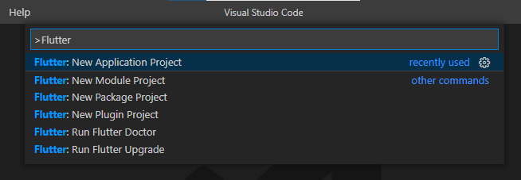

>Catatan: Anda dapat mengakses Command Palette dengan cara lain, yaitu pilih menu View > Command Palette. Tombol shortcut Ctrl + Shift + P mungkin hanya berlaku di Windows.

#### Praktikum 1 - Langkah 2

Kemudian buat folder sesuai style laporan praktikum yang Anda pilih. Disarankan pada folder dokumen atau desktop atau alamat folder lain yang tidak terlalu dalam atau panjang. Lalu pilih Select a folder to create the project in.


#### Praktikum 1 - Langkah 3

Buat nama project flutter hello_world seperti berikut, lalu tekan Enter. Tunggu hingga proses pembuatan project baru selesai.


>Perhatian: Nama project ini harus lowercase (huruf kecil semua) tanpa menggunakan spasi. Untuk memisahkan kata, bisa menggunakan underline (garis bawah). Nama project tidak dapat diawali dengan angka atau karakter khusus lain. Nama project ini bukan nama aplikasi yang akan tampil di Play Store atau App Store. Untuk nama aplikasi, nanti dapat diatur ketika melakukan deployment.

#### Praktikum 1 - Langkah 4

Jika sudah selesai proses pembuatan project baru, pastikan tampilan seperti berikut. Pesan akan tampil berupa "Your Flutter Project is ready!" artinya Anda telah berhasil membuat project Flutter baru.

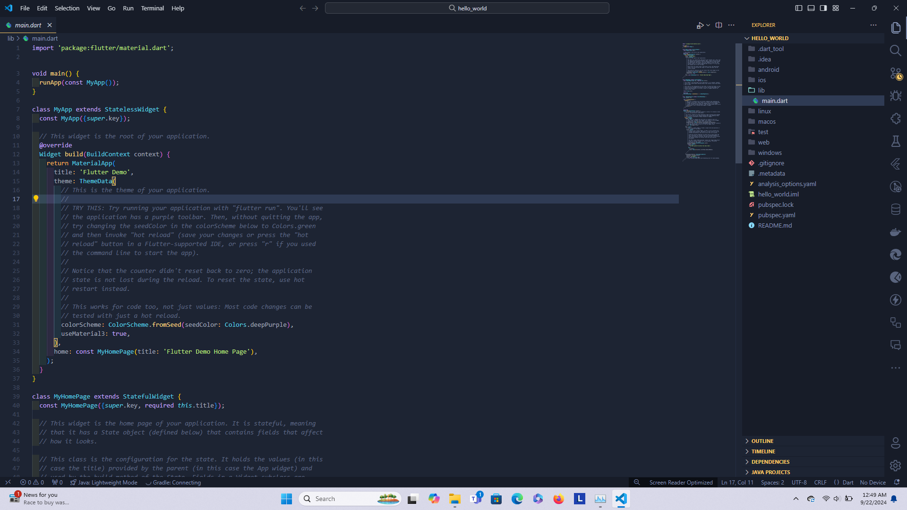

---

### Praktikum 2

Membuat Repository GitHub dan Laporan Praktikum

Melanjutkan dari praktikum 1, silakan selesaikan langkah-langkah berikut ini.

> Perhatian: Diasumsikan Anda telah mempunyai akun GitHub dan Anda telah memahami konsep dasar dalam bekerja menggunakan Git pada pertemuan pertama.

Praktikum ini dapat Anda lewati langsung ke langkah 11 jika sudah paham cara membuat laporan praktikum sesuai style yang Anda pilih.

#### Praktikum 2 - Langkah 1

Login ke akun GitHub Anda, lalu buat repository baru dengan nama "flutter-fundamental-part1"
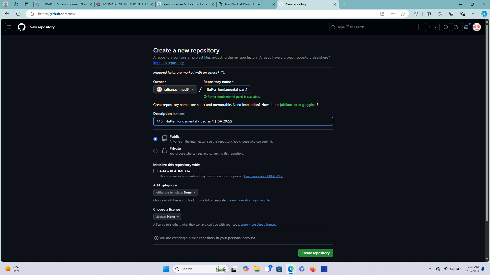

#### Praktikum 2 - Langkah 2

Lalu klik tombol "Create repository" lalu akan tampil seperti gambar berikut.\
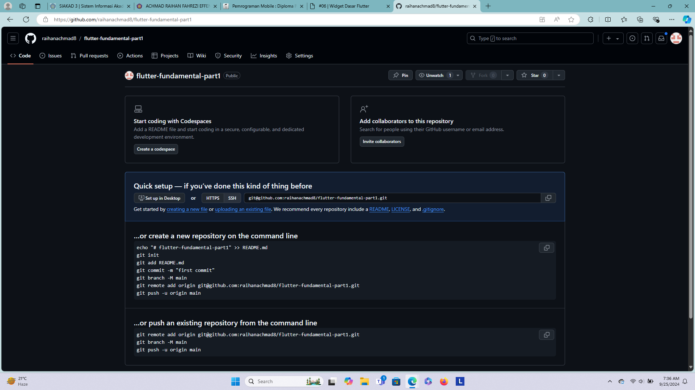

#### Praktikum 2 - Langkah 3

KKembali ke VS code, project flutter hello_world, buka terminal pada menu Terminal > New Terminal. Lalu ketik perintah berikut untuk inisialisasi git pada project Anda.

```bash
git init
```


#### Praktikum 2 - Langkah 4

Pilih menu Source Control di bagian kiri, lalu lakukan stages (+) pada file .gitignore untuk mengunggah file pertama ke repository GitHub.


#### Praktikum 2 - Langkah 5

Beri pesan commit "tambah gitignore" lalu klik Commit (✔)


#### Praktikum 2 - Langkah 6

Lakukan push dengan klik bagian menu titik tiga > Push
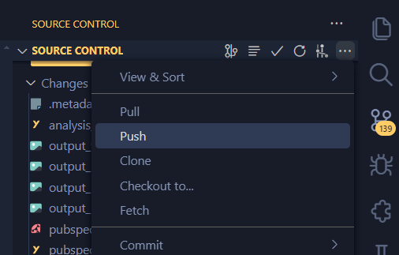

#### Praktikum 2 - Langkah 7

Di pojok kanan bawah akan tampil seperti gambar berikut. Klik "Add Remote"
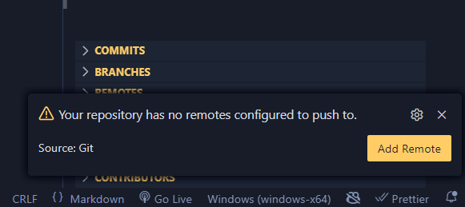

#### Praktikum 2 - Langkah 8

Salin tautan repository Anda dari browser ke bagian ini, lalu klik Add remote

Setelah berhasil, tulis remote name dengan "origin"


#### Praktikum 2 - Langkah 9

Lakukan hal yang sama pada file README.md mulai dari Langkah 4. Setelah berhasil melakukan push, masukkan username GitHub Anda dan password berupa token yang telah dibuat (pengganti password konvensional ketika Anda login di browser GitHub). Reload halaman repository GitHub Anda, maka akan tampil hasil push kedua file tersebut seperti gambar berikut.


> Perhatian: Personal access token GitHub dapat Anda buat melalui <https://github.com/settings/tokens/new> atau dapat membaca dokumentasi GitHub Token.

#### Praktikum 2 - Langkah 10

Lakukan push juga untuk semua file lainnya dengan pilih Stage All Changes. Beri pesan commit "project hello_world". Maka akan tampil di repository GitHub Anda seperti berikut.
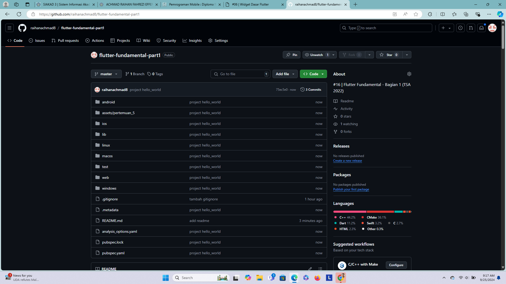

#### Praktikum 2 - Langkah 11

Kembali ke VS Code, ubah platform di pojok kanan bawah ke emulator atau device atau bisa juga menggunakan browser Chrome. Lalu coba running project hello_world dengan tekan F5 atau Run > Start Debugging. Tunggu proses kompilasi hingga selesai, maka aplikasi flutter pertama Anda akan tampil seperti berikut.
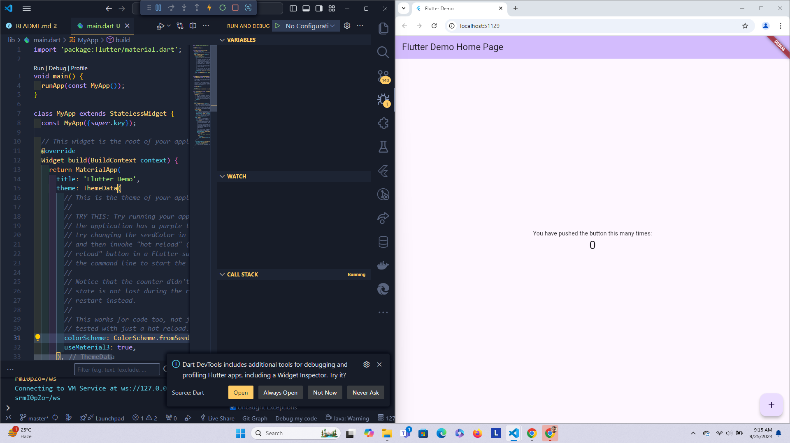

>Perhatian: Proses Run atau kompilasi untuk pertama kali akan memakan waktu cukup lama (3-5 menit). Namun, proses kompilasi berikutnya menjadi lebih cepat. Berbeda ketika melakukan kompilasi ke device, hal ini akan memakan waktu lebih lama lagi.

#### Praktikum 2 - Langkah 12

Silakan screenshot seperti pada Langkah 11, namun teks yang ditampilkan dalam aplikasi berupa nama lengkap Anda. Simpan file screenshot dengan nama 01.png pada folder images (buat folder baru jika belum ada) di project hello_world Anda. Lalu ubah isi README.md seperti berikut, sehingga tampil hasil screenshot pada file README.md. Kemudian push ke repository Anda.


> Perhatian: Lakukan proses screenshot seperti pada Langkah 12 untuk setiap Laporan Praktikum yang Anda akan buat pada praktikum selanjutnya hingga pertemuan project final.

---

### Praktikum 3

Menerapkan Widget Dasar

Selesaikan langkah-langkah praktikum berikut ini dengan melanjutkan dari praktikum sebelumnya.

#### Praktikum 3 - Langkah 1

Text Widget

Buat folder baru basic_widgets di dalam folder lib. Kemudian buat file baru di dalam basic_widgets dengan nama `text_widget.dart`. Ketik atau salin kode program berikut ke project hello_world Anda pada file `text_widget.dart`.

```dart
import 'package:flutter/material.dart';

class MyTextWidget extends StatelessWidget {
  const MyTextWidget({Key? key}) : super(key: key);

  @override
  Widget build(BuildContext context) {
    return const Text(
      "Nama saya Fulan, sedang belajar Pemrograman Mobile",
      style: TextStyle(color: Colors.red, fontSize: 14),
      textAlign: TextAlign.center);
  }
}
```

> Perhatian: Gantilah teks Fulan dengan nama lengkap Anda.

Lakukan import file `text_widget.dart` ke `main.dart`, lalu ganti bagian text widget dengan kode di atas. Maka hasilnya seperti gambar berikut. Screenshot hasil milik Anda, lalu dibuat laporan pada file README.md.

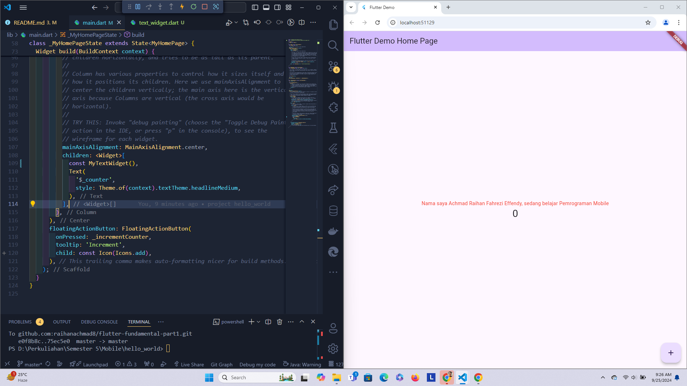

#### Praktikum 3 - Langkah 2

Image Widget

Buat sebuah file `image_widget.dart` di dalam folder basic_widgets dengan isi kode berikut.

```dart
import 'package:flutter/material.dart';

class MyImageWidget extends StatelessWidget {
  const MyImageWidget({Key? key}) : super(key: key);

  @override
  Widget build(BuildContext context) {
    return const Image(
      image: AssetImage("logo_polinema.jpg")
    );
  }
}
```

Lakukan penyesuaian asset pada file `pubspec.yaml` dan tambahkan file logo Anda di folder assets project hello_world.

```yaml
flutter:
  assets:
     - assets/logo_polinema.jpg
```

Jangan lupa sesuaikan kode dan import di file `main.dart` kemudian akan tampil gambar seperti berikut.

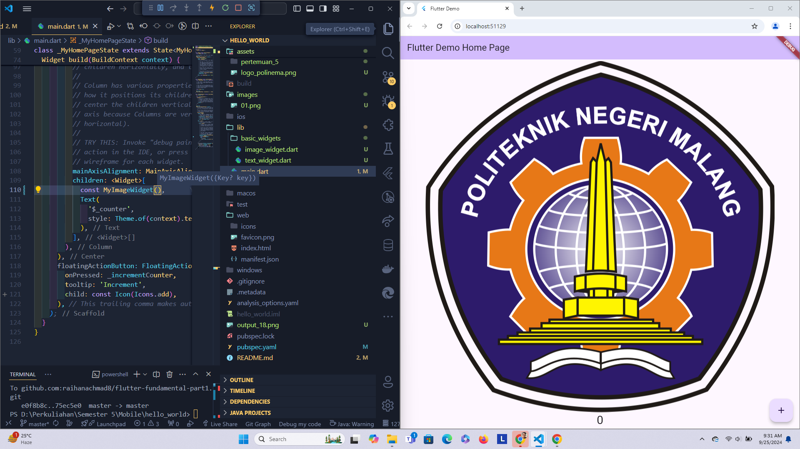

---

### Praktikum 4

Menerapkan Widget Material Design dan iOS Cupertino

Selesaikan langkah-langkah praktikum berikut ini dengan melanjutkan project hello_world Anda. Lakukan langkah yang sama seperti pada Praktikum 3, yaitu setiap widget dibuat file sendiri lalu import ke `main.dart` dan screenshot hasilnya.

#### Praktikum 4 - Langkah 1

Cupertino Button dan Loading Bar

Buat file di basic_widgets > `loading_cupertino.dart`. Import stateless widget dari material dan cupertino. Lalu isi kode di dalam method Widget build adalah sebagai berikut.

```dart
return MaterialApp(
      home: Container(
        margin: const EdgeInsets.only(top: 30),
        color: Colors.white,
        child: Column(
          children: <Widget>[
            CupertinoButton(
              child: const Text("Contoh button"),
              onPressed: () {},
            ),
            const CupertinoActivityIndicator(),
          ],
        ),
      ),
    );
```

#### Praktikum 4 - Langkah 2

Floating Action Button (FAB)

Button widget terdapat beberapa macam pada flutter yaitu ButtonBar, DropdownButton, TextButton, FloatingActionButton, IconButton, OutlineButton, PopupMenuButton, dan ElevatedButton.

Buat file di basic_widgets > `fab_widget.dart`. Import stateless widget dari material. Lalu isi kode di dalam method Widget build adalah sebagai berikut.

#### Praktikum 4 - Langkah 3

Scaffold Widget

Scaffold widget digunakan untuk mengatur tata letak sesuai dengan material design.

Ubah isi kode `main.dart` seperti berikut.

```dart
import 'package:flutter/material.dart';

void main() {
  runApp(const MyApp());
}

class MyApp extends StatelessWidget {
  const MyApp({Key? key}) : super(key: key);

  // This widget is the root of your application.
  @override
  Widget build(BuildContext context) {
    return MaterialApp(
      title: 'Flutter Demo',
      theme: ThemeData(
        primarySwatch: Colors.red,
      ),
      home: const MyHomePage(title: 'My Increment App'),
    );
  }
}

class MyHomePage extends StatefulWidget {
  const MyHomePage({Key? key, required this.title}) : super(key: key);

  final String title;

  @override
  State<MyHomePage> createState() => _MyHomePageState();
}

class _MyHomePageState extends State<MyHomePage> {
  int _counter = 0;

  void _incrementCounter() {
    setState(() {
      _counter++;
    });
  }

  @override
  Widget build(BuildContext context) {
    return Scaffold(
      appBar: AppBar(
        title: Text(widget.title),
      ),
      body: Center(
        child: Column(
          mainAxisAlignment: MainAxisAlignment.center,
          children: <Widget>[
            const Text(
              'You have pushed the button this many times:',
            ),
            Text(
              '$_counter',
              style: Theme.of(context).textTheme.headline4,
            ),
          ],
        ),
      ),
      bottomNavigationBar: BottomAppBar(
        child: Container(
          height: 50.0,
        ),
      ),
      floatingActionButton: FloatingActionButton(
        onPressed: _incrementCounter,
        tooltip: 'Increment Counter',
        child: const Icon(Icons.add),
      ), 
      floatingActionButtonLocation: FloatingActionButtonLocation.centerDocked,
    );
  }
}
```

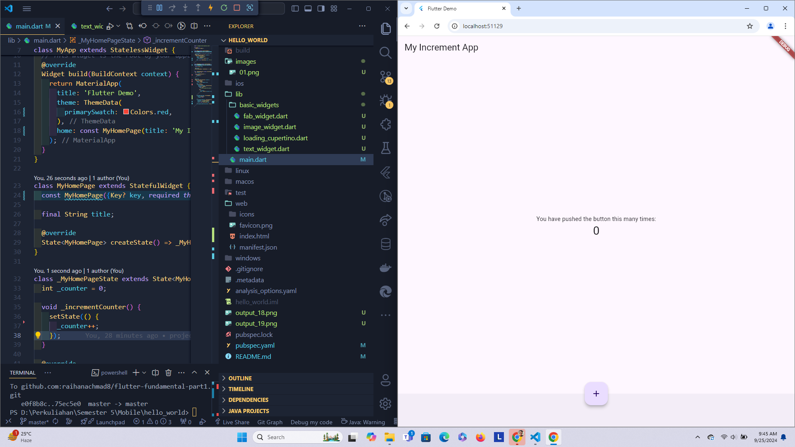

#### Praktikum 4 - Langkah 4

Dialog Widget

Dialog widget pada flutter memiliki dua jenis dialog yaitu `AlertDialog` dan `SimpleDialog`.

Ubah isi kode `main.dart` seperti berikut.

```dart
class MyApp extends StatelessWidget {
  const MyApp({Key? key}) : super(key: key);

  @override
  Widget build(BuildContext context) {
    return const MaterialApp(
      home: Scaffold(
        body: MyLayout(),
      ),
    );
  }
}

class MyLayout extends StatelessWidget {
  const MyLayout({Key? key}) : super(key: key);

  @override
  Widget build(BuildContext context) {
    return Padding(
      padding: const EdgeInsets.all(8.0),
      child: ElevatedButton(
        child: const Text('Show alert'),
        onPressed: () {
          showAlertDialog(context);
        },
      ),
    );
  }
}

showAlertDialog(BuildContext context) {
  // set up the button
  Widget okButton = TextButton(
    child: const Text("OK"),
    onPressed: () {
      Navigator.pop(context);
    },
  );

  // set up the AlertDialog
  AlertDialog alert = AlertDialog(
    title: const Text("My title"),
    content: const Text("This is my message."),
    actions: [
      okButton,
    ],
  );

  // show the dialog
  showDialog(
    context: context,
    builder: (BuildContext context) {
      return alert;
    },
  );
}
```


#### Praktikum 4 - Langkah 5

Input dan Selection Widget

Flutter menyediakan widget yang dapat menerima input dari pengguna aplikasi yaitu antara lain Checkbox, Date and Time Pickers, Radio Button, Slider, Switch, TextField.

Contoh penggunaan TextField widget adalah sebagai berikut:

```dart
class MyApp extends StatelessWidget {
  const MyApp({Key? key}) : super(key: key);

  @override
  Widget build(BuildContext context) {
    return MaterialApp(
      home: Scaffold(
        appBar: AppBar(title: const Text("Contoh TextField")),
        body: const TextField(
          obscureText: false,
          decoration: InputDecoration(
            border: OutlineInputBorder(),
            labelText: 'Nama',
          ),
        ),
      ),
    );
  }
}
```

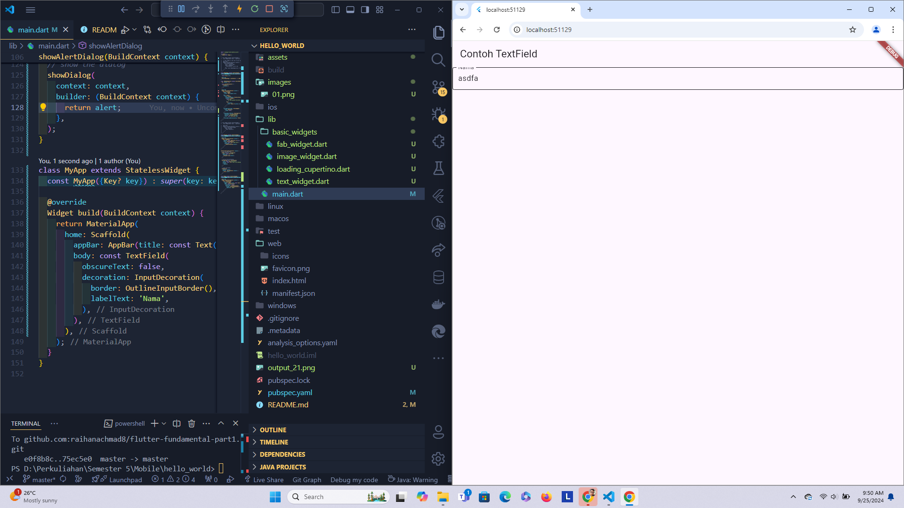

#### Praktikum 4 - Langkah 6

Date and Time Pickers

Date and Time Pickers termasuk pada kategori input dan selection widget, berikut adalah contoh penggunaan Date and Time Pickers.

```dart
import 'dart:async';
import 'package:flutter/material.dart';

void main() => runApp(const MyApp());

class MyApp extends StatelessWidget {
  const MyApp({Key? key}) : super(key: key);

  @override
  Widget build(BuildContext context) {
    return const MaterialApp(
      title: 'Contoh Date Picker',
      home: MyHomePage(title: 'Contoh Date Picker'),
    );
  }
}

class MyHomePage extends StatefulWidget {
  const MyHomePage({Key? key, required this.title}) : super(key: key);

  final String title;

  @override
  _MyHomePageState createState() => _MyHomePageState();
}

class _MyHomePageState extends State<MyHomePage> {
  // Variable/State untuk mengambil tanggal
  DateTime selectedDate = DateTime.now();

  //  Initial SelectDate FLutter
  Future<void> _selectDate(BuildContext context) async {
    // Initial DateTime FIinal Picked
    final DateTime? picked = await showDatePicker(
        context: context,
        initialDate: selectedDate,
        firstDate: DateTime(2015, 8),
        lastDate: DateTime(2101));
    if (picked != null && picked != selectedDate) {
      setState(() {
        selectedDate = picked;
      });
    }
  }

  @override
  Widget build(BuildContext context) {
    return Scaffold(
      appBar: AppBar(
        title: Text(widget.title),
      ),
      body: Center(
        child: Column(
          mainAxisSize: MainAxisSize.min,
          children: <Widget>[
            Text("${selectedDate.toLocal()}".split(' ')[0]),
            const SizedBox(
              height: 20.0,
            ),
            ElevatedButton(
              onPressed: () => {
                _selectDate(context),
                // ignore: avoid_print
                print(selectedDate.day + selectedDate.month + selectedDate.year)
              },
              child: const Text('Pilih Tanggal'),
            ),
          ],
        ),
      ),
    );
  }
}
```


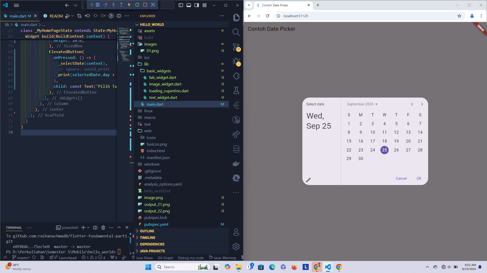

---

### Tugas Praktikum

1. Selesaikan Praktikum 1 sampai 4, lalu dokumentasikan dan push ke repository Anda berupa screenshot setiap hasil pekerjaan beserta penjelasannya di file README.md!
2. Pada praktikum 4 mulai dari Langkah 3 sampai 6, buatlah file widget tersendiri di folder basic_widgets, kemudian pada file `main.dart` cukup melakukan import widget sesuai masing-masing langkah tersebut!
3. Selesaikan Codelabs: Your first Flutter app, lalu buatlah laporan praktikumnya dan push ke repository GitHub Anda!
4. README.md berisi: capture hasil akhir tiap praktikum (side-by-side, bisa juga berupa file GIF agar terlihat proses perubahan ketika ada aksi dari pengguna) di browser dan perangkat fisik (device) dengan menampilkan NIM dan Nama Anda sebagai ciri pekerjaan Anda. Jika mode developer di perangkat HP Anda belum aktif, silakan cari di internet cara mengaktifkannya!
5. Kumpulkan berupa link repository/commit GitHub Anda ke tautan spreadsheet yang telah disepakati oleh dosen!

1. [Klik untuk menuju Praktikum 1 - 4](#praktikum-1)
3. Flutter Codelab `Your first Flutter app`

Pada file `main.dart`
```dart
import 'package:english_words/english_words.dart';
import 'package:flutter/material.dart';
import 'package:provider/provider.dart';

void main() {
  runApp(MyApp());
}

class MyAppState extends ChangeNotifier {
  var current = WordPair.random();

  void getNext() {
    current = WordPair.random();
    notifyListeners();
  }

  var favorites = <WordPair>[];

  void toggleFavorite() {
    if (favorites.contains(current)) {
      favorites.remove(current);
    } else {
      favorites.add(current);
    }
    notifyListeners();
  }
}

class MyApp extends StatelessWidget {
  const MyApp({super.key});

  @override
  Widget build(BuildContext context) {
    return ChangeNotifierProvider(
        create: (context) => MyAppState(),
        child: MaterialApp(
          title: 'Namer App',
          theme: ThemeData(
              useMaterial3: true,
              colorScheme: ColorScheme.fromSeed(seedColor: Colors.deepOrange)),
          home: MyHomePage(),
        ));
  }
}

class MyHomePage extends StatefulWidget {
  @override
  State<MyHomePage> createState() => _MyHomePageState();
}

class _MyHomePageState extends State<MyHomePage> {
  var selectedIndex = 0;

  @override
  Widget build(BuildContext context) {
    Widget page;
    switch (selectedIndex) {
      case 0:
        page = GeneratorPage();
        break;
      case 1:
        page = FavoritesPage();
        break;
      default:
        throw UnimplementedError('no widget for $selectedIndex');
    }

    return LayoutBuilder(builder: (context, constraints) {
      return Scaffold(
        body: Row(
          children: [
            SafeArea(
              child: NavigationRail(
                extended: constraints.maxWidth >= 600, // ← Here.
                destinations: [
                  NavigationRailDestination(
                    icon: Icon(Icons.home),
                    label: Text('Home'),
                  ),
                  NavigationRailDestination(
                    icon: Icon(Icons.favorite),
                    label: Text('Favorites'),
                  ),
                ],
                selectedIndex: selectedIndex,
                onDestinationSelected: (value) {
                  setState(() {
                    selectedIndex = value;
                  });
                },
              ),
            ),
            Expanded(
              child: Container(
                color: Theme.of(context).colorScheme.primaryContainer,
                child: page,
              ),
            ),
          ],
        ),
      );
    });
  }
}

class GeneratorPage extends StatelessWidget {
  @override
  Widget build(BuildContext context) {
    var appState = context.watch<MyAppState>();
    var pair = appState.current;

    IconData icon;
    if (appState.favorites.contains(pair)) {
      icon = Icons.favorite;
    } else {
      icon = Icons.favorite_border;
    }

    return Center(
      child: Column(
        mainAxisAlignment: MainAxisAlignment.center,
        children: [
          Text(
            "Achmad Raihan Fahrezi Effendy",
            style: TextStyle(
              fontWeight: FontWeight.bold,
              fontSize: 20,
            ),
          ),
          Text(
            "2241720192",
            style: TextStyle(
              fontWeight: FontWeight.bold,
              fontSize: 16,
            ),
          ),
          BigCard(pair: pair),
          SizedBox(height: 10),
          Row(
            mainAxisSize: MainAxisSize.min,
            children: [
              ElevatedButton.icon(
                onPressed: () {
                  appState.toggleFavorite();
                },
                icon: Icon(icon),
                label: Text('Like'),
              ),
              SizedBox(width: 10),
              ElevatedButton(
                onPressed: () {
                  appState.getNext();
                },
                child: Text('Next'),
              ),
            ],
          ),
        ],
      ),
    );
  }
}

class FavoritesPage extends StatelessWidget {
  @override
  Widget build(BuildContext context) {
    var appState = context.watch<MyAppState>();

    if (appState.favorites.isEmpty) {
      return Center(
        child: Text('No favorites yet.'),
      );
    }

    return ListView(
      children: [
        Padding(
          padding: const EdgeInsets.all(20),
          child: Text('You have '
              '${appState.favorites.length} favorites:'),
        ),
        for (var pair in appState.favorites)
          ListTile(
            leading: Icon(Icons.favorite),
            title: Text(pair.asLowerCase),
          ),
      ],
    );
  }
}

class BigCard extends StatelessWidget {
  const BigCard({
    super.key,
    required this.pair,
  });

  final WordPair pair;

  @override
  Widget build(BuildContext context) {
    final theme = Theme.of(context);
    // ↓ Add this.
    final style = theme.textTheme.displayMedium!.copyWith(
      color: theme.colorScheme.onPrimary,
    );

    return Card(
      color: theme.colorScheme.primary,
      child: Padding(
        padding: const EdgeInsets.all(20),
        // ↓ Change this line.
        // ↓ Make the following change.
        child: Text(
          pair.asLowerCase,
          style: style,
          semanticsLabel: "${pair.first} ${pair.second}",
        ),
      ),
    );
  }
}
```
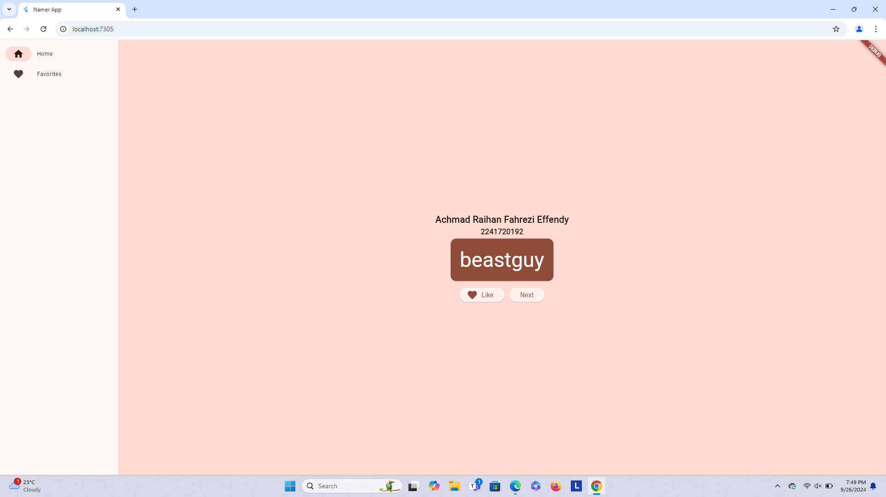
