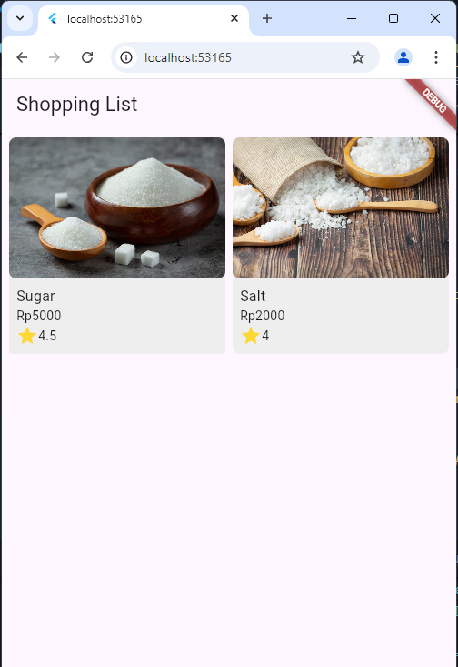

<table>
  <thead>
    <th colspan="2" style="text-align: center;">Pertemuan 6</th>
  </thead>
  <tbody>
    <tr>
      <td>NIM</td>
      <td>2241720192</td>
    </tr>
    <tr>
      <td>Nama</td>
      <td>Achmad Raihan Fahrezi Effendy</td>
    </tr>
    <tr>
      <td>Kelas</td>
      <td>TI-3D</td>
    </tr>
</table>

---

<h3 style="text-align: center; font-weight: bold;">
Layout dan Navigasi
</h3>
Pada codelab ini, Anda akan mempelajari konsep dan praktik untuk dasar-dasar framework Flutter dengan menerapkan layout dan navigasi.

#### **Tujuan Praktikum**

Setelah menyelesaikan codelab ini Anda akan mampu untuk:

- menerapkan jenis-jenis layout
- menerapkan navigasi
- menerapkan routing

---

### Praktikum 1: Membangun Layout di Flutter

> **Apa yang akan Anda pelajari**
>
> - Cara kerja mekanisme tata letak Flutter.
> - Cara menata widget secara vertikal dan horizontal.
> - Cara membuat tata letak Flutter.

Selesaikan langkah-langkah praktikum berikut ini menggunakan editor Visual Studio Code (VS Code) atau Android Studio atau code editor lain kesukaan Anda.

> **Perhatian:** Diasumsikan Anda telah berhasil melakukan setup environment Flutter SDK, VS Code, Flutter Plugin, dan Android SDK pada pertemuan pertama.

Tampilan akhir yang akan Anda buat


#### Praktikum 1 - Langkah 1

Buatlah sebuah project flutter baru dengan nama layout_flutter. Atau sesuaikan style laporan praktikum yang Anda buat.

#### Praktikum 1 - Langkah 2

Buka file `main.dart` lalu ganti dengan kode berikut. Isi nama dan NIM Anda di `text title`.

```dart
import 'package:flutter/material.dart';

void main() => runApp(const MyApp());

class MyApp extends StatelessWidget {
  const MyApp({super.key});

  @override
  Widget build(BuildContext context) {
    return MaterialApp(
      title: 'Flutter layout: Achmad Raihan Fahrezi Effendy - 2241720192',
      home: Scaffold(
        appBar: AppBar(
          title: const Text('Flutter layout demo'),
        ),
        body: const Center(
          child: Text('Hello World'),
        ),
      ),
    );
  }
}
```

Output


#### Praktikum 1 - Langkah 3

Langkah pertama adalah memecah tata letak menjadi elemen dasarnya:

- Identifikasi baris dan kolom.
- Apakah tata letaknya menyertakan kisi-kisi (grid)?
- Apakah ada elemen yang tumpang tindih?
- Apakah UI memerlukan tab?
- Perhatikan area yang memerlukan alignment, padding, atau borders.

Pertama, identifikasi elemen yang lebih besar. Dalam contoh ini, empat elemen disusun menjadi sebuah kolom: sebuah gambar, dua baris, dan satu blok teks.


Kode Program

```dart
import 'package:flutter/material.dart';

void main() => runApp(const MyApp());

class MyApp extends StatelessWidget {
  const MyApp({super.key});

  @override
  Widget build(BuildContext context) {
    return MaterialApp(
      title: 'Flutter layout: Achmad Raihan Fahrezi Effendy - 2241720192',
      home: Scaffold(
          // appBar: AppBar(
          //   title: c onst Text('Flutter layout demo'),
          // ),
          body: Column(
        crossAxisAlignment: CrossAxisAlignment.center,
        children: [
          SizedBox(
            width: double.infinity,
            height: 300,
            child: Image.asset(
              'forest.jpg',
              fit: BoxFit.cover,
            ),
          ),
          titleSection,
        ],
      )),
    );
  }
}
```

Output


Selanjutnya, buat diagram setiap baris. Baris pertama, disebut bagian Judul, memiliki 3 anak: kolom teks, ikon bintang, dan angka. Anak pertamanya, kolom, berisi 2 baris teks. Kolom pertama itu memakan banyak ruang, sehingga harus dibungkus dengan widget yang Diperluas.


Kode Proram

```dart
import 'package:flutter/material.dart';

void main() => runApp(MyApp());

class MyApp extends StatelessWidget {
  MyApp({super.key});

  @override
  Widget build(BuildContext context) {
    return MaterialApp(
      title: 'Flutter layout: Achmad Raihan Fahrezi Effendy - 2241720192',
      home: Scaffold(
          // appBar: AppBar(
          //   title: c onst Text('Flutter layout demo'),
          // ),
          body: Column(
        crossAxisAlignment: CrossAxisAlignment.center,
        children: [
          SizedBox(
            width: double.infinity,
            height: 300,
            child: Image.asset(
              'forest.jpg',
              fit: BoxFit.cover,
            ),
          ),
          titleSection,
        ],
      )),
    );
  }

  Widget titleSection = Container(
    padding: const EdgeInsets.all(32),
    child: Row(
      children: [
        Expanded(
          child: Column(
            crossAxisAlignment: CrossAxisAlignment.start,
            children: [
              Text(
                'Oeschinen Lake Campground',
                style: TextStyle(
                  fontWeight: FontWeight.bold,
                ),
              ),
              Text(
                'Kandersteg, Switzerland',
                style: TextStyle(
                  color: Colors.grey[500],
                ),
              ),
            ],
          ),
        ),
        /*3*/
        Icon(
          Icons.star,
          color: Colors.red[500],
        ),
        Text('41'),
      ],
    ),
  );
}
```

Output


Baris kedua, disebut bagian Tombol, juga memiliki 3 anak: setiap anak merupakan kolom yang berisi ikon dan teks.


Kode Program

```dart
import 'package:flutter/material.dart';
import 'package:flutter/widgets.dart';

void main() => runApp(MyApp());

class MyApp extends StatelessWidget {
  MyApp({super.key});

  @override
  Widget build(BuildContext context) {
    return MaterialApp(
      title: 'Flutter layout: Achmad Raihan Fahrezi Effendy - 2241720192',
      home: Scaffold(
          // appBar: AppBar(
          //   title: c onst Text('Flutter layout demo'),
          // ),
          body: Column(
        crossAxisAlignment: CrossAxisAlignment.center,
        children: [
          SizedBox(
            width: double.infinity,
            height: 300,
            child: Image.asset(
              'forest.jpg',
              fit: BoxFit.cover,
            ),
          ),
          titleSection,
          buttonSection,
        ],
      )),
    );
  }

  Widget titleSection = Container(
    padding: const EdgeInsets.all(32),
    child: Row(
      children: [
        Expanded(
          child: Column(
            crossAxisAlignment: CrossAxisAlignment.start,
            children: [
              Text(
                'Oeschinen Lake Campground',
                style: TextStyle(
                  fontWeight: FontWeight.bold,
                ),
              ),
              Text(
                'Kandersteg, Switzerland',
                style: TextStyle(
                  color: Colors.grey[500],
                ),
              ),
            ],
          ),
        ),
        /*3*/
        Icon(
          Icons.star,
          color: Colors.red[500],
        ),
        Text('41'),
      ],
    ),
  );

  static Widget _buildButtonColumn(Color color, IconData icon, String label) {
    return Column(
      mainAxisSize: MainAxisSize.min,
      mainAxisAlignment: MainAxisAlignment.center,
      children: [
        Icon(
          icon,
          color: color,
        ),
        Container(
          margin: const EdgeInsets.only(top: 8),
          child: Text(
            label,
            style: TextStyle(
              fontSize: 12,
              fontWeight: FontWeight.w400,
              color: color,
            ),
          ),
        ),
      ],
    );
  }

  Widget buttonSection = Row(
    mainAxisAlignment: MainAxisAlignment.spaceEvenly,
    children: [
      _buildButtonColumn(Colors.blue, Icons.call, 'CALL'),
      _buildButtonColumn(Colors.blue, Icons.near_me, 'ROUTE'),
      _buildButtonColumn(Colors.blue, Icons.share, 'SHARE'),
    ],
  );

  
}
```

Output


Setelah tata letak telah dibuat diagramnya, cara termudah adalah dengan menerapkan pendekatan bottom-up. Untuk meminimalkan kebingungan visual dari kode tata letak yang banyak bertumpuk, tempatkan beberapa implementasi dalam variabel dan fungsi.

#### Praktikum 1 - Langkah 4

Pertama, Anda akan membuat kolom bagian kiri pada judul. Tambahkan kode berikut di bagian atas metode build() di dalam kelas MyApp:

**/* soal 1 */** Letakkan widget Column di dalam widget Expanded agar menyesuaikan ruang yang tersisa di dalam widget Row. Tambahkan properti crossAxisAlignment ke CrossAxisAlignment.start sehingga posisi kolom berada di awal baris.

**/* soal 2 */** Letakkan baris pertama teks di dalam Container sehingga memungkinkan Anda untuk menambahkan padding = 8. Teks ‘Batu, Malang, Indonesia' di dalam Column, set warna menjadi abu-abu.

**/* soal 3 */** Dua item terakhir di baris judul adalah ikon bintang, set dengan warna merah, dan teks "41". Seluruh baris ada di dalam Container dan beri padding di sepanjang setiap tepinya sebesar 32 piksel. Kemudian ganti isi body text ‘Hello World' dengan variabel titleSection seperti berikut:


Perbaikan Kode

```dart
import 'package:flutter/material.dart';
import 'package:flutter/widgets.dart';

void main() => runApp(MyApp());

class MyApp extends StatelessWidget {
  MyApp({super.key});

  @override
  Widget build(BuildContext context) {
    return MaterialApp(
      title: 'Flutter layout: Achmad Raihan Fahrezi Effendy - 2241720192',
      home: Scaffold(
          // appBar: AppBar(
          //   title: c onst Text('Flutter layout demo'),
          // ),
          body: Column(
        crossAxisAlignment: CrossAxisAlignment.center,
        children: [
          titleSection,
        ],
      )),
    );
  }

  Widget titleSection = Container(
    padding: const EdgeInsets.all(32),
    child: Row(
      children: [
        Expanded(
          child: Column(
            crossAxisAlignment: CrossAxisAlignment.start,
            children: [
              Container(
                padding: const EdgeInsets.only(bottom: 8),
                child: const Text(
                  'Wisata Gunung di Batu',
                  style: TextStyle(
                    fontWeight: FontWeight.bold,
                  ),
                ),
              ),
              Text(
                'Batu, Malang, Indonesia',
                style: TextStyle(
                  color: Colors.grey[500],
                ),
              ),
            ],
          ),
        ),
        /*3*/
        Icon(
          Icons.star,
          color: Colors.red[500],
        ),
        const Text('41'),
      ],
    ),
  );
}
```

Output

---

### Praktikum 2: Implementasi button row

Selesaikan langkah-langkah praktikum berikut ini dengan melanjutkan dari praktikum sebelumnya.

#### Praktikum 2 - Langkah 1

Buat method Column _buildButtonColumn
Bagian tombol berisi 3 kolom yang menggunakan tata letak yang sama—sebuah ikon di atas baris teks. Kolom pada baris ini diberi jarak yang sama, dan teks serta ikon diberi warna primer.

Karena kode untuk membangun setiap kolom hampir sama, buatlah metode pembantu pribadi bernama buildButtonColumn(), yang mempunyai parameter warna, Icon dan Text, sehingga dapat mengembalikan kolom dengan widgetnya sesuai dengan warna tertentu.

lib/main.dart (_buildButtonColumn)

```dart
class MyApp extends StatelessWidget {
  const MyApp({super.key});

  @override
  Widget build(BuildContext context) {
    // ···
  }

  Column _buildButtonColumn(Color color, IconData icon, String label) {
    return Column(
      mainAxisSize: MainAxisSize.min,
      mainAxisAlignment: MainAxisAlignment.center,
      children: [
        Icon(icon, color: color),
        Container(
          margin: const EdgeInsets.only(top: 8),
          child: Text(
            label,
            style: TextStyle(
              fontSize: 12,
              fontWeight: FontWeight.w400,
              color: color,
            ),
          ),
        ),
      ],
    );
  }
}
```

#### Praktikum 2 - Langkah 2

Buat widget buttonSection
Buat Fungsi untuk menambahkan ikon langsung ke kolom. Teks berada di dalam Container dengan margin hanya di bagian atas, yang memisahkan teks dari ikon.

Bangun baris yang berisi kolom-kolom ini dengan memanggil fungsi dan set warna, Icon, dan teks khusus melalui parameter ke kolom tersebut. Sejajarkan kolom di sepanjang sumbu utama menggunakan MainAxisAlignment.spaceEvenly untuk mengatur ruang kosong secara merata sebelum, di antara, dan setelah setiap kolom. Tambahkan kode berikut tepat di bawah deklarasi titleSection di dalam metode build():

lib/main.dart (buttonSection)

#### Praktikum 2 - Langkah 3

```dart
Color color = Theme.of(context).primaryColor;

Widget buttonSection = Row(
  mainAxisAlignment: MainAxisAlignment.spaceEvenly,
  children: [
    _buildButtonColumn(color, Icons.call, 'CALL'),
    _buildButtonColumn(color, Icons.near_me, 'ROUTE'),
    _buildButtonColumn(color, Icons.share, 'SHARE'),
  ],
);
```

Tambahkan variabel buttonSection ke dalam body seperti berikut:


Full Kode

```dart
import 'package:flutter/material.dart';

void main() => runApp(MyApp());

class MyApp extends StatelessWidget {
  MyApp({super.key});

  @override
  Widget build(BuildContext context) {
    Color color = Theme.of(context).primaryColor;

    Widget buttonSection = Row(
      mainAxisAlignment: MainAxisAlignment.spaceEvenly,
      children: [
        _buildButtonColumn(color, Icons.call, 'CALL'),
        _buildButtonColumn(color, Icons.near_me, 'ROUTE'),
        _buildButtonColumn(color, Icons.share, 'SHARE'),
      ],
    );

    return MaterialApp(
      title: 'Flutter layout: Achmad Raihan Fahrezi Effendy - 2241720192',
      home: Scaffold(
          // appBar: AppBar(
          //   title: c onst Text('Flutter layout demo'),
          // ),
          body: Column(
        crossAxisAlignment: CrossAxisAlignment.center,
        children: [
          titleSection,
          buttonSection,
        ],
      )),
    );
  }

  Widget titleSection = Container(
    padding: const EdgeInsets.all(32),
    child: Row(
      children: [
        Expanded(
          child: Column(
            crossAxisAlignment: CrossAxisAlignment.start,
            children: [
              Container(
                padding: const EdgeInsets.only(bottom: 8),
                child: const Text(
                  'Wisata Gunung di Batu',
                  style: TextStyle(
                    fontWeight: FontWeight.bold,
                  ),
                ),
              ),
              Text(
                'Batu, Malang, Indonesia',
                style: TextStyle(
                  color: Colors.grey[500],
                ),
              ),
            ],
          ),
        ),
        /*3*/
        Icon(
          Icons.star,
          color: Colors.red[500],
        ),
        const Text('41'),
      ],
    ),
  );

  Column _buildButtonColumn(Color color, IconData icon, String label) {
    return Column(
      mainAxisSize: MainAxisSize.min,
      mainAxisAlignment: MainAxisAlignment.center,
      children: [
        Icon(icon, color: color),
        Container(
          margin: const EdgeInsets.only(top: 8),
          child: Text(
            label,
            style: TextStyle(
              fontSize: 12,
              fontWeight: FontWeight.w400,
              color: color,
            ),
          ),
        ),
      ],
    );
  }
}
```

Output


---

### Praktikum 3: Implementasi text section

Selesaikan langkah-langkah praktikum berikut ini dengan melanjutkan dari praktikum sebelumnya.

#### Praktikum 3 - Langkah 1

Buat widget textSection
Tentukan bagian teks sebagai variabel. Masukkan teks ke dalam Container dan tambahkan padding di sepanjang setiap tepinya. Tambahkan kode berikut tepat di bawah deklarasi buttonSection:

```dart
Widget textSection = Container(
  padding: const EdgeInsets.all(32),
  child: const Text(
    'Carilah teks di internet yang sesuai '
    'dengan foto atau tempat wisata yang ingin '
    'Anda tampilkan. '
    'Tambahkan nama dan NIM Anda sebagai '
    'identitas hasil pekerjaan Anda. '
    'Selamat mengerjakan 🙂.',
    softWrap: true,
  ),
);
```

Dengan memberi nilai softWrap = true, baris teks akan memenuhi lebar kolom sebelum membungkusnya pada batas kata.

#### Praktikum 3 - Langkah 2

Tambahkan widget variabel textSection ke dalam body seperti berikut:


Full Kode

```dart
import 'package:flutter/material.dart';

void main() => runApp(MyApp());

class MyApp extends StatelessWidget {
  MyApp({super.key});

  @override
  Widget build(BuildContext context) {
    Color color = Theme.of(context).primaryColor;

    Widget buttonSection = Row(
      mainAxisAlignment: MainAxisAlignment.spaceEvenly,
      children: [
        _buildButtonColumn(color, Icons.call, 'CALL'),
        _buildButtonColumn(color, Icons.near_me, 'ROUTE'),
        _buildButtonColumn(color, Icons.share, 'SHARE'),
      ],
    );

    return MaterialApp(
      title: 'Flutter layout: Achmad Raihan Fahrezi Effendy - 2241720192',
      home: Scaffold(
          // appBar: AppBar(
          //   title: c onst Text('Flutter layout demo'),
          // ),
          body: Column(
        crossAxisAlignment: CrossAxisAlignment.center,
        children: [
          titleSection,
          buttonSection,
          textSection,
        ],
      )),
    );
  }

  Widget titleSection = Container(
    padding: const EdgeInsets.all(32),
    child: Row(
      children: [
        Expanded(
          child: Column(
            crossAxisAlignment: CrossAxisAlignment.start,
            children: [
              Container(
                padding: const EdgeInsets.only(bottom: 8),
                child: const Text(
                  'Wisata Gunung di Batu',
                  style: TextStyle(
                    fontWeight: FontWeight.bold,
                  ),
                ),
              ),
              Text(
                'Batu, Malang, Indonesia',
                style: TextStyle(
                  color: Colors.grey[500],
                ),
              ),
            ],
          ),
        ),
        /*3*/
        Icon(
          Icons.star,
          color: Colors.red[500],
        ),
        const Text('41'),
      ],
    ),
  );

  Column _buildButtonColumn(Color color, IconData icon, String label) {
    return Column(
      mainAxisSize: MainAxisSize.min,
      mainAxisAlignment: MainAxisAlignment.center,
      children: [
        Icon(icon, color: color),
        Container(
          margin: const EdgeInsets.only(top: 8),
          child: Text(
            label,
            style: TextStyle(
              fontSize: 12,
              fontWeight: FontWeight.w400,
              color: color,
            ),
          ),
        ),
      ],
    );
  }

  Widget textSection = Container(
    padding: const EdgeInsets.all(32),
    child: const Text(
      'Carilah teks di internet yang sesuai '
      'dengan foto atau tempat wisata yang ingin '
      'Anda tampilkan. '
      'Tambahkan nama dan NIM Anda sebagai '
      'identitas hasil pekerjaan Anda. '
      'Selamat mengerjakan 🙂.',
      softWrap: true,
    ),
  );
}
```

Output


---

### Praktikum 4: Implementasi image section

Selesaikan langkah-langkah praktikum berikut ini dengan melanjutkan dari praktikum sebelumnya.

#### Praktikum 4 - Langkah 1

Anda dapat mencari gambar di internet yang ingin ditampilkan. Buatlah folder images di root project layout_flutter. Masukkan file gambar tersebut ke folder images, lalu set nama file tersebut ke file pubspec.yaml seperti berikut:

Contoh nama file gambar di atas adalah lake.jpg

> Tips

> - Perhatikan bahwa pubspec.yaml sensitif terhadap huruf besar-kecil, jadi tulis assets: dan URL gambar seperti yang ditunjukkan di atas.
> - File pubspec juga sensitif terhadap spasi, jadi gunakan indentasi yang tepat.
> - Anda mungkin perlu memulai ulang program yang sedang berjalan (baik di simulator atau perangkat yang terhubung) agar perubahan pubspec dapat diterapkan.

#### Praktikum 4 - Langkah 2

Tambahkan aset gambar ke dalam body seperti berikut:

BoxFit.cover memberi tahu kerangka kerja bahwa gambar harus sekecil mungkin tetapi menutupi seluruh kotak rendernya.

Full Kode

```dart
import 'package:flutter/material.dart';

void main() => runApp(MyApp());

class MyApp extends StatelessWidget {
  MyApp({super.key});

  @override
  Widget build(BuildContext context) {
    Color color = Theme.of(context).primaryColor;

    Widget buttonSection = Row(
      mainAxisAlignment: MainAxisAlignment.spaceEvenly,
      children: [
        _buildButtonColumn(color, Icons.call, 'CALL'),
        _buildButtonColumn(color, Icons.near_me, 'ROUTE'),
        _buildButtonColumn(color, Icons.share, 'SHARE'),
      ],
    );

    return MaterialApp(
      title: 'Flutter layout: Achmad Raihan Fahrezi Effendy - 2241720192',
      home: Scaffold(
          // appBar: AppBar(
          //   title: c onst Text('Flutter layout demo'),
          // ),
          body: Column(
        crossAxisAlignment: CrossAxisAlignment.center,
        children: [
          Image.asset(
            'images/lake.jpg',
            width: 600,
            height: 240,
            fit: BoxFit.cover,
          ),
          titleSection,
          buttonSection,
          textSection,
        ],
      )),
    );
  }

  Widget titleSection = Container(
    padding: const EdgeInsets.all(32),
    child: Row(
      children: [
        Expanded(
          child: Column(
            crossAxisAlignment: CrossAxisAlignment.start,
            children: [
              Container(
                padding: const EdgeInsets.only(bottom: 8),
                child: const Text(
                  'Wisata Gunung di Batu',
                  style: TextStyle(
                    fontWeight: FontWeight.bold,
                  ),
                ),
              ),
              Text(
                'Batu, Malang, Indonesia',
                style: TextStyle(
                  color: Colors.grey[500],
                ),
              ),
            ],
          ),
        ),
        /*3*/
        Icon(
          Icons.star,
          color: Colors.red[500],
        ),
        const Text('41'),
      ],
    ),
  );

  Column _buildButtonColumn(Color color, IconData icon, String label) {
    return Column(
      mainAxisSize: MainAxisSize.min,
      mainAxisAlignment: MainAxisAlignment.center,
      children: [
        Icon(icon, color: color),
        Container(
          margin: const EdgeInsets.only(top: 8),
          child: Text(
            label,
            style: TextStyle(
              fontSize: 12,
              fontWeight: FontWeight.w400,
              color: color,
            ),
          ),
        ),
      ],
    );
  }

  Widget textSection = Container(
    padding: const EdgeInsets.all(32),
    child: const Text(
      'Carilah teks di internet yang sesuai '
      'dengan foto atau tempat wisata yang ingin '
      'Anda tampilkan. '
      'Tambahkan nama dan NIM Anda sebagai '
      'identitas hasil pekerjaan Anda. '
      'Selamat mengerjakan 🙂.',
      softWrap: true,
    ),
  );
}
```

Output


#### Praktikum 4 - Langkah 3

Pada langkah terakhir ini, atur semua elemen dalam ListView, bukan Column, karena ListView mendukung scroll yang dinamis saat aplikasi dijalankan pada perangkat yang resolusinya lebih kecil.


Update build method

```dart

  @override
  Widget build(BuildContext context) {
    Color color = Theme.of(context).primaryColor;

    Widget buttonSection = Row(
      mainAxisAlignment: MainAxisAlignment.spaceEvenly,
      children: [
        _buildButtonColumn(color, Icons.call, 'CALL'),
        _buildButtonColumn(color, Icons.near_me, 'ROUTE'),
        _buildButtonColumn(color, Icons.share, 'SHARE'),
      ],
    );

    return MaterialApp(
      title: 'Flutter layout: Achmad Raihan Fahrezi Effendy - 2241720192',
      home: Scaffold(
          // appBar: AppBar(
          //   title: c onst Text('Flutter layout demo'),
          // ),
          // body: Column(
          // crossAxisAlignment: CrossAxisAlignment.center,
          body: ListView(
        children: [
          Image.asset(
            'images/lake.jpg',
            width: 600,
            height: 240,
            fit: BoxFit.cover,
          ),
          titleSection,
          buttonSection,
          textSection,
        ],
      )),
    );
  }
```

---

### Praktikum 5: Membangun Navigasi di Flutter

> Apa yang akan Anda pelajari
>
> - Cara kerja mekanisme navigation dan route di Flutter.
> - Cara membuat navigation dan route di Flutter.

Selesaikan langkah-langkah praktikum berikut ini menggunakan editor Visual Studio Code (VS Code) atau Android Studio atau code editor lain kesukaan Anda. Materi ini dapat dimasukkan ke Laporan Praktikum folder Week atau Pertemuan 06.

Tampilan akhir yang akan Anda buat


Pada praktikum 5 ini anda akan belajar mengenai pembangunan aplikasi bergerak multi halaman. Aplikasi yang dikembangkan berupa kasus daftar barang belanja. Pada aplikasi ini anda akan belajar untuk berpindah halaman dan mengirimkan data ke halaman lainnya. Gambaran mockup hasil akhir aplikasi dapat anda lihat pada gambar di atas (mockup dibuat sederhana, sehingga Anda mempunyai banyak ruang untuk berkreasi). Desain aplikasi menampilkan sebuah ListView widget yang datanya bersumber dari List. Ketika item ditekan, data akan dikirimkan ke halaman berikutnya.

#### Praktikum 5 - Langkah 1

Sebelum melanjutkan praktikum, buatlah sebuah project baru Flutter dengan nama belanja dan susunan folder seperti pada gambar berikut. Penyusunan ini dimaksudkan untuk mengorganisasi kode dan widget yang lebih mudah.


#### Praktikum 5 - Langkah 2

Buatlah dua buah file dart dengan nama home_page.dart dan item_page.dart pada folder pages. Untuk masing-masing file, deklarasikan class HomePage pada file home_page.dart dan ItemPage pada item_page.dart. Turunkan class dari StatelessWidget. Gambaran potongan kode dapat anda lihat sebagai berikut.


HomePage

```dart
import 'package:flutter/material.dart';

class HomePage extends StatelessWidget {
  const HomePage({super.key});

  @override
  Widget build(BuildContext context) {
    return const Placeholder();
  }
}
```

ItemPage

```dart
import 'package:flutter/material.dart';

class ItemPage extends StatelessWidget {
  const ItemPage({super.key});

  @override
  Widget build(BuildContext context) {
    return const Placeholder();
  }
}
```

#### Praktikum 5 - Langkah 3

Setelah kedua halaman telah dibuat dan didefinisikan, bukalah file main.dart. Pada langkah ini anda akan mendefinisikan Route untuk kedua halaman tersebut. Definisi penamaan route harus bersifat unique. Halaman HomePage didefinisikan sebagai /. Dan halaman ItemPage didefinisikan sebagai /item. Untuk mendefinisikan halaman awal, anda dapat menggunakan named argument initialRoute. Gambaran tahapan ini, dapat anda lihat pada potongan kode berikut.


`main.dart`

```dart
import 'package:flutter/material.dart';
import 'package:belanja/pages/home_pages.dart';
import 'package:belanja/pages/item_pages.dart';

void main() {
  runApp(MaterialApp(
    initialRoute: '/',
    routes: {
      '/': (context) => const HomePage(),
      '/item': (context) => const ItemPage(),
    },
  ));
}
```

#### Praktikum 5 - Langkah 4

Sebelum melakukan perpindahan halaman dari HomePage ke ItemPage, dibutuhkan proses pemodelan data. Pada desain mockup, dibutuhkan dua informasi yaitu nama dan harga. Untuk menangani hal ini, buatlah sebuah file dengan nama item.dart dan letakkan pada folder models. Pada file ini didefinisikan pemodelan data yang dibutuhkan. Ilustrasi kode yang dibutuhkan, dapat anda lihat pada potongan kode berikut.


`item.dart`

```dart
class Item {
  String name;
  int price;

  Item({required this.name, required this.price});
}
```

#### Praktikum 5 - Langkah 5

Pada halaman HomePage terdapat ListView widget. Sumber data ListView diambil dari model List dari object Item. Gambaran kode yang dibutuhkan untuk melakukan definisi model dapat anda lihat sebagai berikut.


`home_pages.dart`

```dart
import 'package:flutter/material.dart';
import 'package:balanja/models/item.dart';

class HomePage extends StatelessWidget {
  HomePage({super.key});

  final List<Item> items = [
    Item(name: 'Sugar', price: 5000),
    Item(name: 'Salt', price: 2000)
  ];

  @override
  Widget build(BuildContext context) {
    return const Placeholder();
  }
}
```

#### Praktikum 5 - Langkah 6

Untuk menampilkan ListView pada praktikum ini digunakan itemBuilder. Data diambil dari definisi model yang telah dibuat sebelumnya. Untuk menunjukkan batas data satu dan berikutnya digunakan widget Card. Kode yang telah umum pada bagian ini tidak ditampilkan. Gambaran kode yang dibutuhkan dapat anda lihat sebagai berikut.

Jalankan aplikasi pada emulator atau pada device anda.

home_page.dart

```dart
import 'package:flutter/material.dart';
import 'package:belanja/models/item.dart';

class HomePage extends StatelessWidget {
  HomePage({super.key});

  final List<Item> items = [
    Item(name: 'Sugar', price: 5000),
    Item(name: 'Salt', price: 2000)
  ];

  @override
  Widget build(BuildContext context) {
    return Scaffold(
      appBar: AppBar(
        title: const Text('Shopping List'),
      ),
      body: Container(
        margin: const EdgeInsets.all(8),
        child: ListView.builder(
          padding: const EdgeInsets.all(8),
          itemCount: items.length,
          itemBuilder: (context, index) {
            final item = items[index];
            return Card(
              child: Container(
                margin: const EdgeInsets.all(8),
                child: Row(
                  children: [
                    Expanded(
                      child: Text(item.name),
                    ),
                    Expanded(
                        child: Text(
                      item.price.toString(),
                      textAlign: TextAlign.end,
                    )),
                  ],
                ),
              ),
            );
          },
        ),
      ),
    );
  }
}
```


> Perhatian: Pastikan pada halaman awal telah berhasil menampilkan ListView. Jika ada kesalahan, segera perbaiki sebelum melanjutkan ke langkah berikutnya.

#### Praktikum 5 - Langkah 7

Item pada ListView saat ini ketika ditekan masih belum memberikan aksi tertentu. Untuk menambahkan aksi pada ListView dapat digunakan widget InkWell atau GestureDetector. Perbedaan utamanya InkWell merupakan material widget yang memberikan efek ketika ditekan. Sedangkan GestureDetector bersifat umum dan bisa juga digunakan untuk gesture lain selain sentuhan. Pada praktikum ini akan digunakan widget InkWell.

Untuk menambahkan sentuhan, letakkan cursor pada widget pembuka Card. Kemudian gunakan shortcut quick fix dari VSCode (Ctrl + . pada Windows atau Cmd + . pada MacOS). Sorot menu wrap with widget... Ubah nilai widget menjadi InkWell serta tambahkan named argument onTap yang berisi fungsi untuk berpindah ke halaman ItemPage. Ilustrasi potongan kode dapat anda lihat pada potongan berikut.


Jalankan aplikasi kembali dan pastikan ListView dapat disentuh dan berpindah ke halaman berikutnya. Periksa kembali jika terdapat kesalahan.

home_page.dart

```dart
import 'package:flutter/material.dart';
import 'package:belanja/models/item.dart';

class HomePage extends StatelessWidget {
  HomePage({super.key});

  final List<Item> items = [
    Item(name: 'Sugar', price: 5000),
    Item(name: 'Salt', price: 2000)
  ];

  @override
  Widget build(BuildContext context) {
    return Scaffold(
      appBar: AppBar(
        title: const Text('Shopping List'),
      ),
      body: Container(
        margin: const EdgeInsets.all(8),
        child: ListView.builder(
          padding: const EdgeInsets.all(8),
          itemCount: items.length,
          itemBuilder: (context, index) {
            final item = items[index];
            return InkWell(
              onTap: () {
                Navigator.pushNamed(context, '/item');
              },
              child: Card(
                child: Container(
                  margin: const EdgeInsets.all(8),
                  child: Row(
                    children: [
                      Expanded(
                        child: Text(item.name),
                      ),
                      Expanded(
                          child: Text(
                        item.price.toString(),
                        textAlign: TextAlign.end,
                      )),
                    ],
                  ),
                ),
              ),
            );
          },
        ),
      ),
    );
  }
}
```

Setelah berpindah


---

## Tugas Praktikum 1

1. Selesaikan Praktikum 1 sampai 4, lalu dokumentasikan dan push ke repository Anda berupa screenshot setiap hasil pekerjaan beserta penjelasannya di file README.md!
[Praktikum 1 -4](#praktikum-1-membangun-layout-di-flutter)

2. Silakan implementasikan di project baru "basic_layout_flutter" dengan mengakses sumber ini: <https://docs.flutter.dev/codelabs/layout-basics>
Buat layout seperti ini:


Kode Program

`main.dart`

```dart
import 'package:flutter/material.dart';

void main() {
  runApp(const MyApp());
}

class MyApp extends StatelessWidget {
  const MyApp({super.key});

  @override
  Widget build(BuildContext context) {
    final titleText = Container(
      padding: const EdgeInsets.all(20),
      child: const Text(
        'Strawberry Pavlova',
        style: TextStyle(
          fontWeight: FontWeight.w800,
          letterSpacing: 0.5,
          fontSize: 30,
        ),
      ),
    );

    final subTitle = const Text(
      'Pavlova is a meringue-based dessert named after the Russian ballerina Anna Pavlova. Pavlova features a crisp crust and soft, light inside, topped with fruit and whipped cream.',
      textAlign: TextAlign.center,
      style: TextStyle(
        fontFamily: 'Georgia',
        fontSize: 25,
      ),
    );

    final stars = Row(
      mainAxisSize: MainAxisSize.min,
      children: [
        Icon(Icons.star, color: Colors.green[500]),
        Icon(Icons.star, color: Colors.green[500]),
        Icon(Icons.star, color: Colors.green[500]),
        const Icon(Icons.star, color: Colors.black),
        const Icon(Icons.star, color: Colors.black),
      ],
    );

    final ratings = Container(
      padding: const EdgeInsets.all(20),
      child: Row(
        mainAxisAlignment: MainAxisAlignment.spaceEvenly,
        children: [
          stars,
          const Text(
            '170 Reviews',
            style: TextStyle(
              color: Colors.black,
              fontWeight: FontWeight.w800,
              fontFamily: 'Roboto',
              letterSpacing: 0.5,
              fontSize: 20,
            ),
          ),
        ],
      ),
    );

    const descTextStyle = TextStyle(
      color: Colors.black,
      fontWeight: FontWeight.w800,
      fontFamily: 'Roboto',
      letterSpacing: 0.5,
      fontSize: 18,
      height: 2,
    );

// DefaultTextStyle.merge() allows you to create a default text
// style that is inherited by its child and all subsequent children.
    final iconList = DefaultTextStyle.merge(
      style: descTextStyle,
      child: Container(
        padding: const EdgeInsets.all(20),
        child: Row(
          mainAxisAlignment: MainAxisAlignment.spaceEvenly,
          children: [
            Column(
              children: [
                Icon(Icons.kitchen, color: Colors.green[500]),
                const Text('PREP:'),
                const Text('25 min'),
              ],
            ),
            Column(
              children: [
                Icon(Icons.timer, color: Colors.green[500]),
                const Text('COOK:'),
                const Text('1 hr'),
              ],
            ),
            Column(
              children: [
                Icon(Icons.restaurant, color: Colors.green[500]),
                const Text('FEEDS:'),
                const Text('4-6'),
              ],
            ),
          ],
        ),
      ),
    );

    final leftColumn = Container(
      padding: const EdgeInsets.fromLTRB(20, 30, 20, 20),
      child: Column(
        children: [
          titleText,
          subTitle,
          ratings,
          iconList,
        ],
      ),
    );

    final mainImage = Expanded(
      child: Image.asset(
        'images/pavlova.png',
        height: double.infinity,
        fit: BoxFit.cover,
      ),
    );

    return MaterialApp(
      title: 'Flutter layout: Achmad Raihan Fahrezi Effendy - 2241720192',
      home: Scaffold(
        body: Center(
          child: Container(
            margin: const EdgeInsets.fromLTRB(0, 40, 0, 30),
            height: 600,
            child: Card(
              child: Row(
                crossAxisAlignment: CrossAxisAlignment.start,
                children: [
                  SizedBox(
                    width: 440,
                    child: leftColumn,
                  ),
                  mainImage,
                ],
              ),
            ),
          ),
        ),
      ),
    );
  }
}
```

Output


3. Kumpulkan link commit repository GitHub Anda kepada dosen yang telah disepakati!

---

## Tugas Praktikum 2

1. Untuk melakukan pengiriman data ke halaman berikutnya, cukup menambahkan informasi arguments pada penggunaan Navigator. Perbarui kode pada bagian Navigator menjadi seperti berikut.
`Navigator.pushNamed(context, '/item', arguments: item);`
2. Pembacaan nilai yang dikirimkan pada halaman sebelumnya dapat dilakukan menggunakan ModalRoute. Tambahkan kode berikut pada blok fungsi build dalam halaman ItemPage. Setelah nilai didapatkan, anda dapat menggunakannya seperti penggunaan variabel pada umumnya. (<https://docs.flutter.dev/cookbook/navigation/navigate-with-arguments>)
final itemArgs = ModalRoute.of(context)!.settings.arguments as Item;

Update `item_page.dart`

```dart
import 'package:flutter/material.dart';
import 'package:belanja/models/item.dart';

class ItemPage extends StatelessWidget {
  const ItemPage({super.key});

  @override
  Widget build(BuildContext context) {
    final itemArgs = ModalRoute.of(context)!.settings.arguments as Item;
    if (itemArgs != null) {
      return Scaffold(
        appBar: AppBar(
          title: Text(itemArgs.name),
        ),
        body: Center(
          child: Column(
            mainAxisAlignment: MainAxisAlignment.center,
            children: [
              Text('Name: ${itemArgs.name}'),
              Text('Price: ${itemArgs.price}'),
            ],
          ),
        ),
      );
    }
    return const Scaffold(
      // appBar: AppBar(
      //   title: Text('Error'),
      // ),
      body: Center(
        child: Text('Item not found'),
      ),
    );
  }
}
```

Output


3. Pada hasil akhir dari aplikasi belanja yang telah anda selesaikan, tambahkan atribut foto produk, stok, dan rating. Ubahlah tampilan menjadi GridView seperti di aplikasi marketplace pada umumnya.

Full Kode

```dart
import 'package:flutter/material.dart';
import 'package:belanja/models/item.dart';

class HomePage extends StatelessWidget {
  HomePage({super.key});

  final List<Item> items = [
    Item(
        name: 'Sugar',
        price: 5000,
        image: 'images/sugar.jpg',
        stock: 10,
        rating: 4.5),
    Item(
        name: 'Salt',
        price: 2000,
        image: 'images/saltx`.jpg',
        stock: 20,
        rating: 4.0),
  ];

  @override
  Widget build(BuildContext context) {
    return Scaffold(
      appBar: AppBar(
        title: const Text('Shopping List'),
      ),
      body: Container(
        padding: const EdgeInsets.all(8),
        child: GridView.builder(
          gridDelegate: const SliverGridDelegateWithFixedCrossAxisCount(
            crossAxisCount: 2,
            crossAxisSpacing: 8,
            mainAxisSpacing: 8,
          ),
          itemCount: items.length,
          itemBuilder: (context, index) {
            final item = items[index];
            return InkWell(
              onTap: () {
                Navigator.pushNamed(context, '/item', arguments: item);
              },
              child: Container(
                decoration: BoxDecoration(
                  color: Colors.white,
                  borderRadius: BorderRadius.circular(8),
                ),
                child: Column(
                  crossAxisAlignment: CrossAxisAlignment.start,
                  children: [
                    Expanded(
                      child: ClipRRect(
                        borderRadius: BorderRadius.circular(
                            8), // Half of the width/height for a perfect circle
                        child: Image.asset(
                          item.image,
                          fit:
                              BoxFit.cover, // Adjust width and height as needed
                          height: 100,
                        ),
                      ),
                    ),
                    Container(
                      padding: const EdgeInsets.all(8),
                      child: Column(
                        crossAxisAlignment: CrossAxisAlignment.start,
                        children: [
                          Text(item.name, style: const TextStyle(fontSize: 16)),
                          Text("Rp${item.price.toString()}"),
                          Row(
                            children: [
                              Icon(
                                Icons.star,
                                color: Colors.yellow[600],
                              ),
                              Text(item.rating.toString())
                            ],
                          )
                        ],
                      ),
                    )
                  ],
                ),
              ),
            );
          },
        ),
      ),
    );
  }
}
```

Output


4. Silakan implementasikan Hero widget pada aplikasi belanja Anda dengan mempelajari dari sumber ini: <https://docs.flutter.dev/cookbook/navigation/hero-animations>

Full Kode

`home_pages.dart`

```dart
import 'package:belanja/models/item.dart';
import 'package:flutter/material.dart';

class HomePage extends StatelessWidget {
  HomePage({super.key});

  final List<Item> items = [
    Item(
        name: 'Sugar',
        price: 5000,
        image: 'images/sugar.png',
        stock: 10,
        rating: 4.5),
    Item(
        name: 'Salt',
        price: 2000,
        image: 'images/salt.png',
        stock: 20,
        rating: 4.0),
  ];

  @override
  Widget build(BuildContext context) {
    return Scaffold(
      appBar: AppBar(
        title: const Text('Shopping List'),
      ),
      body: Column(
        children: [
          Expanded(
            child: Container(
              padding: const EdgeInsets.all(8),
              child: GridView.builder(
                gridDelegate: const SliverGridDelegateWithFixedCrossAxisCount(
                  crossAxisCount: 2,
                  crossAxisSpacing: 8,
                  mainAxisSpacing: 8,
                ),
                itemCount: items.length,
                itemBuilder: (context, index) {
                  final item = items[index];
                  return InkWell(
                    onTap: () {
                      Navigator.pushNamed(context, '/item', arguments: item);
                    },
                    child: Container(
                      decoration: BoxDecoration(
                        color: Colors.grey[200],
                        borderRadius: BorderRadius.circular(8),
                      ),
                      child: Column(
                        crossAxisAlignment: CrossAxisAlignment.start,
                        children: [
                          Expanded(
                            child: Hero(
                              tag: item.image,
                              child: ClipRRect(
                                borderRadius: BorderRadius.circular(
                                    8), // Half of the width/height for a perfect circle
                                child: Image.asset(
                                  item.image,
                                  fit: BoxFit
                                      .cover, // Adjust width and height as needed
                                  height: 100,
                                  width: double.infinity,
                                ),
                              ),
                            ),
                          ),
                          Container(
                            padding: const EdgeInsets.all(8),
                            child: Column(
                              crossAxisAlignment: CrossAxisAlignment.start,
                              children: [
                                Text(item.name,
                                    style: const TextStyle(fontSize: 16)),
                                Text("Rp${item.price.toString()}"),
                                Row(
                                  children: [
                                    Icon(
                                      Icons.star,
                                      color: Colors.yellow[600],
                                    ),
                                    Text(item.rating.toString())
                                  ],
                                )
                              ],
                            ),
                          )
                        ],
                      ),
                    ),
                  );
                },
              ),
            ),
          ),
          Container(
            padding: const EdgeInsets.all(16),
            color: Colors.grey[300],
            child: const Row(
              mainAxisAlignment: MainAxisAlignment.center,
              children: [
                Text('© 2024 Achmad Raihan Fahrezi Effendy - 2241720192',
                    style: TextStyle(fontSize: 16)),
              ],
            ),
          ),
        ],
      ),
    );
  }
}
```

`item_pages.dart`

```dart
import 'package:belanja/models/item.dart';
import 'package:flutter/material.dart';

class ItemPage extends StatelessWidget {
  const ItemPage({super.key});

  @override
  Widget build(BuildContext context) {
    final itemArgs = ModalRoute.of(context)!.settings.arguments as Item;
    return Scaffold(
      appBar: AppBar(
        title: Text(itemArgs.name),
      ),
      body: Column(
        crossAxisAlignment: CrossAxisAlignment.start,
        children: [
          Expanded(
            child: Column(
              children: [
                Hero(
                    tag: itemArgs.image,
                    child: Image.asset(itemArgs.image,
                        fit: BoxFit.cover,
                        width: double.infinity,
                        height: 300)),
                Padding(
                  padding: EdgeInsets.all(8),
                  child: Column(
                    crossAxisAlignment: CrossAxisAlignment.start,
                    children: [
                      Text(itemArgs.name,
                          style: TextStyle(
                              fontSize: 24, fontWeight: FontWeight.bold)),
                      Row(
                        children: [
                          Text('Stock: ${itemArgs.stock}'),
                          Text(" | "),
                          Icon(
                            Icons.star,
                            color: Colors.yellow[600],
                          ),
                          Text("${itemArgs.rating}"),
                        ],
                      ),
                      Text('Rp${itemArgs.price}'),
                    ],
                  ),
                ),
              ],
            ),
          ),
          Container(
            padding: const EdgeInsets.all(16),
            color: Colors.grey[300],
            child: const Row(
              mainAxisAlignment: MainAxisAlignment.center,
              children: [
                Text('© 2024 Achmad Raihan Fahrezi Effendy - 2241720192',
                    style: TextStyle(fontSize: 16)),
              ],
            ),
          ),
        ],
      ),
    );
  }
}
```
Output


5. Sesuaikan dan modifikasi tampilan sehingga menjadi aplikasi yang menarik. Selain itu, pecah widget menjadi kode yang lebih kecil. Tambahkan Nama dan NIM di footer aplikasi belanja Anda.

6. Selesaikan Praktikum 5: Navigasi dan Rute tersebut. Cobalah modifikasi menggunakan plugin go_router, lalu dokumentasikan dan push ke repository Anda berupa screenshot setiap hasil pekerjaan beserta penjelasannya di file README.md. Kumpulkan link commit repository GitHub Anda kepada dosen yang telah disepakati!
Back
