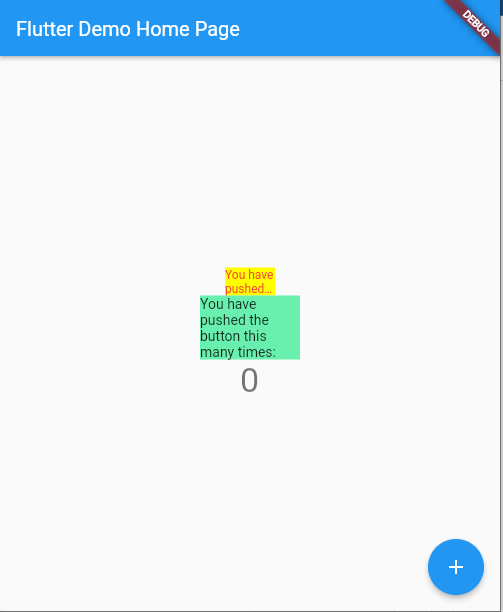
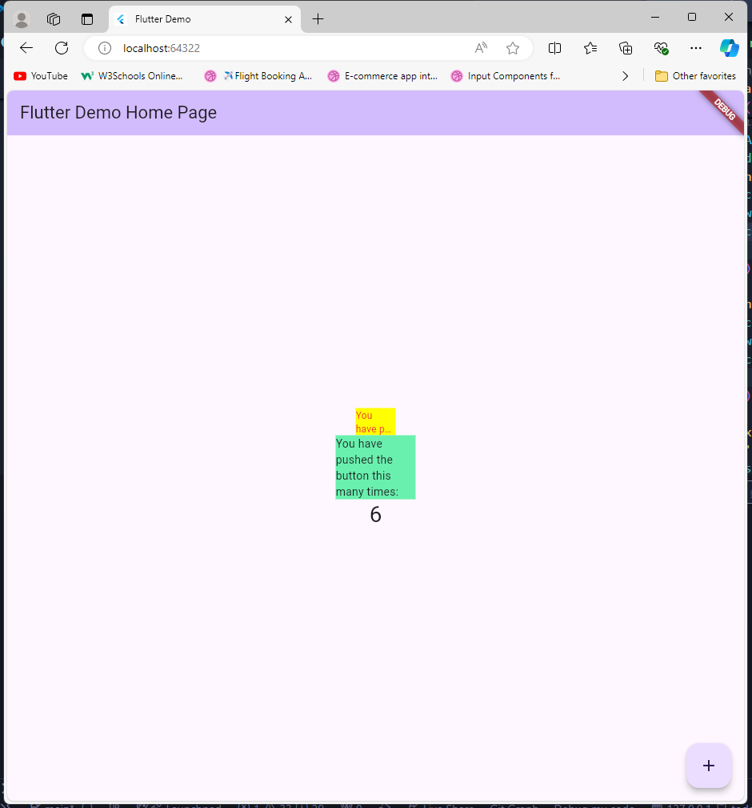

# Pemrograman Mobile - Pertemuan 7

<table>
  <thead>
    <th colspan="2" style="text-align: center;">Pertemuan 6</th>
  </thead>
  <tbody>
    <tr>
      <td>NIM</td>
      <td>2241720192</td>
    </tr>
    <tr>
      <td>Nama</td>
      <td>Achmad Raihan Fahrezi Effendy</td>
    </tr>
    <tr>
      <td>Kelas</td>
      <td>TI-3D</td>
    </tr>
</table>

---

<h3 style="text-align: center; font-weight: bold;">
Manajemen Plugin di Flutter
</h3>

Pada codelab ini, Anda akan mempelajari tentang plugin Flutter beserta contoh penggunaannya. Cara kerja, manfaat, dan cara memasang plugin ke dalam project flutter.


#### **Tujuan Praktikum**

Setelah menyelesaikan codelab ini Anda akan mampu untuk:

- menjelaskan manfaat plugin
- memasang plugin ke dalam project flutter
- memanfaatkan plugin dalam aplikasi

---

### Praktikum Menerapkan Plugin di Project Flutter

Selesaikan langkah-langkah praktikum berikut ini menggunakan editor Visual Studio Code (VS Code) atau Android Studio atau code editor lain kesukaan Anda.

> Perhatian: Diasumsikan Anda telah berhasil melakukan setup environment Flutter SDK, VS Code, Flutter Plugin, dan Android SDK pada pertemuan pertama.

#### Langkah 1: Buat Project Baru

Buatlah sebuah project flutter baru dengan nama flutter_plugin_pubdev. Lalu jadikan repository di GitHub Anda dengan nama flutter_plugin_pubdev.

#### Langkah 2: Menambahkan Plugin

Tambahkan plugin auto_size_text menggunakan perintah berikut di terminal

`flutter pub add auto_size_text`

Jika berhasil, maka akan tampil nama plugin beserta versinya di file pubspec.yaml pada bagian dependencies.

#### Langkah 3: Buat file red_text_widget.dart

Buat file baru bernama `red_text_widget.dart` di dalam folder lib lalu isi kode seperti berikut.

```dart
import 'package:flutter/material.dart';

class RedTextWidget extends StatelessWidget {
  const RedTextWidget({Key? key}) : super(key: key);

  @override
  Widget build(BuildContext context) {
    return Container();
  }
}
```

#### Langkah 4: Tambah Widget AutoSizeText

Masih di file `red_text_widget.dart`, untuk menggunakan plugin `auto_size_text`, ubahlah kode `return Container()` menjadi seperti berikut.

```dart
return AutoSizeText(
      text,
      style: const TextStyle(color: Colors.red, fontSize: 14),
      maxLines: 2,
      overflow: TextOverflow.ellipsis,
);
```

Setelah Anda menambahkan kode di atas, Anda akan mendapatkan info error. Mengapa demikian? Jelaskan dalam laporan praktikum Anda!

#### Langkah 5: Buat Variabel text dan parameter di constructor

Tambahkan variabel text dan parameter di constructor seperti berikut.

```dart
final String text;

const RedTextWidget({Key? key, required this.text}) : super(key: key);
```

#### Langkah 6: Tambahkan widget di main.dart

Buka file `main.dart` lalu tambahkan di dalam `children:` pada `class _MyHomePageState`

```dart
Container(
   color: Colors.yellowAccent,
   width: 50,
   child: const RedTextWidget(
             text: 'You have pushed the button this many times:',
          ),
),
Container(
    color: Colors.greenAccent,
    width: 100,
    child: const Text(
           'You have pushed the button this many times:',
          ),
),
```

Run aplikasi tersebut dengan tekan F5, maka hasilnya akan seperti berikut.


---

Output


### Tugas Praktikum

1. Selesaikan Praktikum tersebut, lalu dokumentasikan dan push ke repository Anda berupa screenshot hasil pekerjaan beserta penjelasannya di file README.md!
[Praktikum Menerapkan Plugin di Project Flutter](#praktikum-menerapkan-plugin-di-project-flutter)
2. Jelaskan maksud dari langkah 2 pada praktikum tersebut!
**Jawaban**
Pada Langkah ini ditambahkan dependensi `auto_size_text` ke dalam project, yang memungkinkan penggunaan widget `AutoSizeText` untuk menampilkan teks dengan ukuran yang otomatis menyesuaikan dengan ruang yang tersedia.
3. Jelaskan maksud dari langkah 5 pada praktikum tersebut!
**Jawaban**
Pada Langkah ini mendefinisikan variabel text dan menambahkan parameter pada constructor RedTextWidget, sehingga pengguna dapat mengirimkan teks yang ingin ditampilkan saat menggunakan widget tersebut.
4. Pada langkah 6 terdapat dua widget yang ditambahkan, jelaskan fungsi dan perbedaannya!
**Jawaban**
RedTextWidget menggunakan AutoSizeText untuk menampilkan teks dengan ukuran responsif, sedangkan widget Text biasa tidak melakukan penyesuaian otomatis, hanya menampilkan teks dengan ukuran tetap
5. Jelaskan maksud dari tiap parameter yang ada di dalam plugin auto_size_text berdasarkan tautan pada dokumentasi ini !
**Jawaban**
Parameter text adalah isi teks yang ditampilkan, style mengatur gaya teks (seperti warna dan ukuran), maxLines menentukan jumlah maksimum baris, dan overflow mengatur bagaimana teks yang melampaui batas ruang ditampilkan (misalnya dengan elipsis).
6. Kumpulkan laporan praktikum Anda berupa link repository GitHub kepada dosen!
